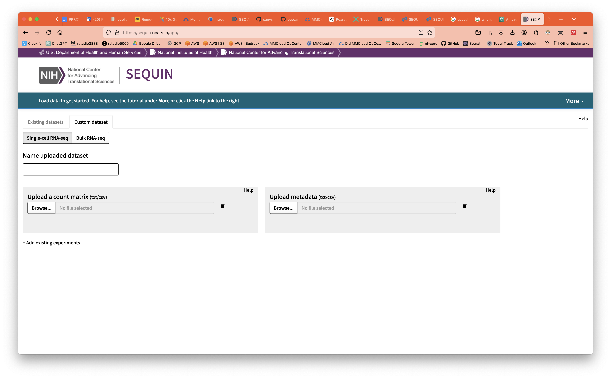

# Sequin

SEQUIN is a user-friendly, web-based Shiny application designed to simplify RNA sequencing data analysis for researchers and students who may not have extensive programming experience. Built on R/Bioconductor framework, this interactive tool streamlines the process of differential expression analysis, allowing users to upload count data, perform statistical testing using DESeq2, and generate publication-quality visualizations such as volcano plots and heatmaps, all through an intuitive point-and-click interface.

[GO TO SEQUIN :fontawesome-solid-dna:](https://sequin.ncats.io/app/){ .md-button .md-button--primary }

## Tutorial

There is a comprehensive tutorial on the SEQUIN website. From the landing page, select `More` in the top right and then `Tutorial`.  

