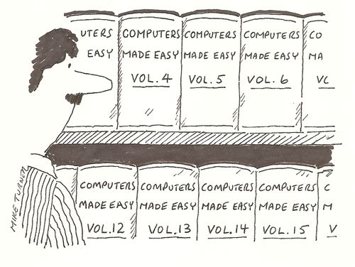
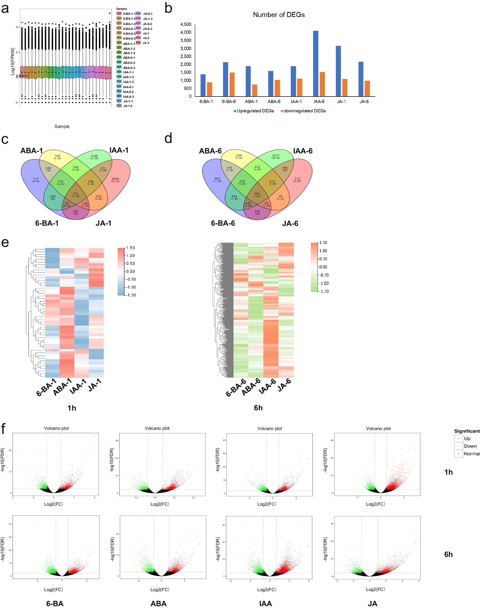
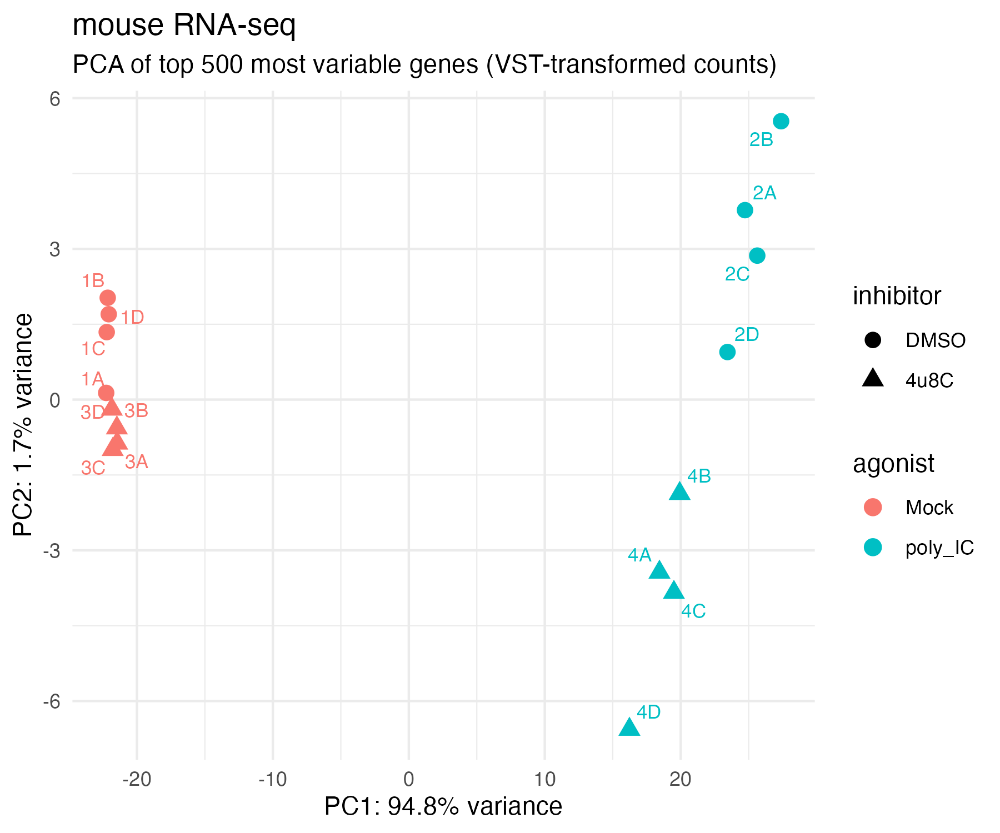
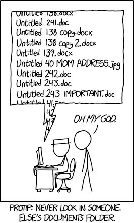
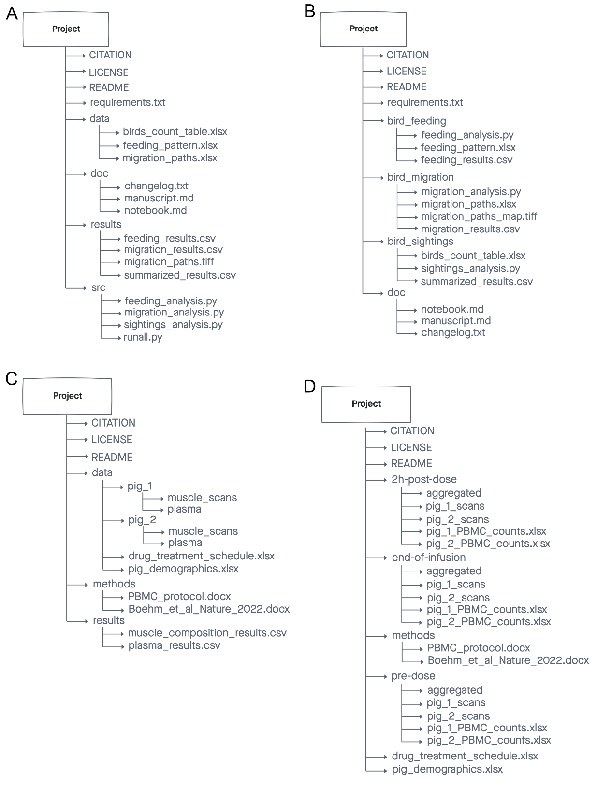

# Managing Data & Projects for Genomics

> **Workshop:** ~90 minutes hands-on &nbsp;·&nbsp; This page stays open for independent study and office-hours follow-up.

---

!!! info "Learning Objectives"
    By the end of this workshop you will be able to:

    - Describe what counts as "data" in a genomics project
    - Explain the FAIR data principles and why they matter
    - Identify what metadata to collect for genomics experiments
    - Create a README file that documents a project directory
    - Apply a consistent file and folder naming convention

---

## Why This Matters

{ align=right style="width:210px; border-radius:6px; margin-left:1.5rem; margin-bottom:0.5rem;" }

Computers are essential across all areas of modern science. We use them to collect, analyze, store, and share data — and to collaborate and write manuscripts. But most researchers are never taught the computational equivalent of **basic lab skills**: the everyday practices that keep data findable, interpretable, and reusable.

The result is familiar to almost everyone who has done research:

- You can't find a file you created six months ago.
- A collaborator sends you data with no explanation of what anything means.
- You receive a gene list from a paper and half the names don't match your dataset.
- You finish a project and realize the analysis cannot be reproduced.

These are not failures of intelligence — they are failures of systems. This workshop introduces practical, everyday practices to avoid them.

{ align=left style="width:210px; border-radius:6px; margin-right:1.5rem; margin-bottom:0.5rem;" }

The collaborator who benefits most from good data practices is the one every researcher cares about: **your future self**.

<br style="clear:both;">

!!! abstract "Discussion — Before reading on..."
    Think about these questions with a partner or on your own:

    1. What was the last file or data item you couldn't find in your own work?
    2. What part of your workflow — wet lab → sequencing → analysis → writing — loses track of information most easily?

---

## What Counts as Data?

The word "data" often conjures up images of spreadsheets and measurement tables. In genomics, the reality is far broader.


???+ question "Exercise — Brainstorm: What are all the data types in your current project?"
    Take 3 minutes. For a genomics project you are working on (or have worked on), list every type of data involved. 

    ??? success "Solution"

        Data in a genomics project includes far more than gene expression tables:

        | Category | Examples |
        |----------|----------|
        | **Raw instrument data** | FASTQ files, raw intensity files, mass spec outputs |
        | **Reference data** | Genome assemblies (`.fa.gz`), annotation files (`.gtf`), transcript-to-gene maps |
        | **Metadata** | Sample sheets, experimental design files, library prep records |
        | **Processed data** | Aligned BAM files, count matrices, normalized expression tables |
        | **Analysis outputs** | Differential expression results, PCA plots, volcano plots |
        | **Code and scripts** | R Markdown files, Python scripts, Nextflow/Snakemake workflows |
        | **Documentation** | README files, data dictionaries, lab notebooks, protocols |
        | **Results** | Published figures, supplementary tables, manuscript drafts |

???+ question "Exercise - How do you find your data? Who keeps track of it?"

	Now that we know what counts as data for your project, consider:

	- How many of these pieces of data are not currently documented anywhere?
	- How many are kept in separate places or by separate people?
	- Which one would be the biggest disaster if it got lost?
	- **Who is responsible for knowing where the data lives and how it's managed?**

	??? success "Solution"
	
		You are responsible for knowing where your data lives, how it was generated, and what stage it is in.
	
		<figure markdown="span">
			{ style="width:380px; border-radius:6px;" }
		</figure>

        

---

## Part 1: FAIR Data Principles

<figure markdown="span">
	{ style="width:520px; border-radius:6px;" }
</figure>


The **FAIR Guiding Principles** (published in *Scientific Data*, 2016) define best practices for data management and stewardship. Originally aimed at published datasets, they are equally valuable for everyday project management.

The goal: make data **Findable, Accessible, Interoperable, and Reusable** — by both humans and computers.

!!! abstract "Before reading on..."
    For each letter in FAIR, write down what you think it means before reading the definitions below.

### Findable

Data and metadata should be **easy to locate and identify**.

For published resources, this means using persistent identifiers: DOIs, PubMed IDs, GEO/SRA accession numbers, UniProt/Ensembl/NCBI gene IDs. Within a project, findability comes from:

- **Consistent file naming** — a standardized convention makes files scannable and searchable
- **Logical folder structure** — related files grouped together, with clear hierarchy
- **Searchable metadata** — a record that describes the dataset's location, contents, and context

**If future-you or a collaborator can't find it, it's not FAIR.**

### Accessible

Published data and metadata should be **retrievable via standard methods** — downloading from NCBI, querying BioMart, fetching from a model organism database.

For project-level work, accessibility means:

- Files are in a known, documented location (local path, server path, cloud URL)
- Anyone with appropriate permissions can find and open those files
- The file format is readable without specialized software
- Data contents are interpretable without asking the creator

### Interoperable

Data should be **usable across tools and systems**.

In practice:

- Use **open, non-proprietary file formats** — `.csv`, `.tsv`, `.fastq.gz`, `.bam`, `.vcf` instead of `.xlsx`, `.ods`
- Store **numeric data as numbers** — never as PDFs or images of tables
- Always provide the **underlying numerical data** used to generate figures

### Reusable

Data should be **ready for replication and reuse in new contexts**. This requires:

- **Detailed, structured metadata** — biological sample details, experimental design, analysis tools, data locations
- **A README file** describing project organization and processing steps
- **Tidy data structure** — one variable per column, one observation per row, one value per cell
- **Clear, descriptive column headers** — `weight_g` rather than `wt`

---

### What Happens When Data Aren't FAIR?

The following three scenarios are adapted from real situations researchers encounter.

???+ question "Exercise 1.1 — Uninterpretable file names"

    You receive a dataset from a collaborator:

    ```
    /shared/Misc_Stuff/new/old/backup2/FASTQs/SeqData2/RNAseq_Run1/
    ├── A1.fastq.gz
    ├── A2.fastq.gz
    ├── ...
    └── H12.fastq.gz
    ```

    1. Which biological samples are `A1.fastq.gz` and `H12.fastq.gz`?
    2. Is there a control group? How many replicates?
    3. Can you re-analyze this data in 6 months without emailing your collaborator?

    ??? success "Solution"

        You cannot answer any of these questions from the file names or directory alone.

        - `A1`–`H12` are plate-well positions. Without a sample sheet there is no way to know which biological sample occupies each well.
        - There are no metadata files in the directory.
        - Folder names like `Misc_Stuff`, `new/old/backup2` give zero information about the project, organism, or date.

        **FAIR principles violated:** Findable (no consistent naming), Accessible (not interpretable), Reusable (no metadata).

        **What would fix it:** Rename files with a convention that encodes biological information; add a `samplesheet.csv` that maps file name → sample → condition → replicate; add a README.

???+ question "Exercise 1.2 — Mismatched gene identifiers"

    You compile a gene list from three papers:

    ```
    TP53
    Actb
    MYC
    pax6
    Gapdh
    ```

    You try to look these up in your RNA-seq results, and only 2 out of 5 match.

    1. Why might these names fail to match?
    2. What should you have used instead?

    ??? success "Solution"

        | Gene | Problem |
        |------|---------|
        | `TP53` | Human HGNC symbol — mouse equivalent is `Trp53` |
        | `Actb` | Mouse mixed-case — analysis pipeline may expect `ACTB` or Ensembl ID |
        | `MYC` | Human symbol — correct species? |
        | `pax6` | Lowercase — annotation likely uses `Pax6` |
        | `Gapdh` | Mouse mixed-case — some annotations use `GAPDH` |

        **The fix:** Use Ensembl gene IDs as primary identifiers. Include the human-readable name as a convenience column but join by ID. Always document the organism, annotation version, and ID source.

???+ question "Exercise 1.3 — Undocumented analysis file"

    You receive `DEGs_table.csv` with 847 rows and columns:

    ```
    gene  baseMean  log2FC  lfcSE  stat  pvalue  padj
    ```

    List everything you would need to correctly interpret, share, or reproduce this analysis.

    ??? success "Solution"

        At minimum you need:

        - **What tool was used** — DESeq2? edgeR? Each calculates `log2FC` differently
        - **What the comparison is** — which condition is treatment vs. control?
        - **What filtering was applied** — count threshold? Minimum CPM?
        - **What normalization was used** — default DESeq2 median-of-ratios? Something custom?
        - **What reference was used** — genome build, annotation version, organism
        - **What statistical cutoffs** — is `padj` Benjamini-Hochberg? What threshold?
        - **Who ran it and when** — author, date, software version

        A file named `DEGs_table.csv` with no accompanying README is **not reusable**. The more information provided, the better.

### A Special Note on Gene IDs

Gene IDs can cause your data to violate the FAIR principles. Use this guidance to maintain FAIR data.

!!! warning "Gene names are not unique identifiers"
    Human-readable gene names like `TP53`, `ACTB`, or `Gapdh` are not safe to use as primary identifiers in analysis:

    - **Not unique across species** — `TP53` is the human gene; `Trp53` is mouse; `tp53` is zebrafish
    - **Prone to case errors** — `actb` and `ACTB` won't match in a case-sensitive join
    - **Subject to renaming** — deprecated names cause silent mismatches when annotations update

    Use standard, unique gene identifiers instead:

    | ID Type | Example | Source |
    |---------|---------|--------|
    | Ensembl Gene ID | `ENSG00000141510` | Ensembl |
    | Entrez Gene ID | `7157` | NCBI |
    | UniProt ID | `P04637` | UniProt |

    Always document the **organism, annotation release, and annotation source** alongside any gene list. It is fine to include human-readable names as a convenience column — just never use them as the join key in an analysis.

!!! success "Key Points"
    - FAIR data is Findable, Accessible, Interoperable, and Reusable.
    - These principles apply to everyday project data, not just published datasets.
    - Poor naming, missing metadata, and non-standard identifiers are the most common FAIR failures.

---

## Part 2: Metadata

### What Is Metadata?

Metadata is **data about your data** — information that describes what the data are and how they were generated. Without it, a file is often uninterpretable.

A FASTQ file named `A1.fastq.gz` means nothing on its own. Add a **sample sheet** that maps this file to all the information about that sample. Each column of a sample sheet should contain a different field of information about the samples, such as:

- *FASTQ file:* `A1.fastq.gz`
- *Condition:* Mock DMSO
- *Replicate*: 1A
- *Cell type:* mouse J774A.1 macrophage cells
- *Data type:* polyA-selected RNA-seq

With this additional metadata, now the data files are more FAIR.

In genomics, metadata connects **samples → sequencing → analysis → results**. Without it, you cannot:

- Recreate analyses or compare across studies
- Identify which files belong to which biological replicates
- Map results back to experimental conditions
- Share data with a repository or collaborator

### Types of Metadata

| Type | What it covers |
|------|---------------|
| **Descriptive** | What the dataset is — title, authors, abstract, keywords |
| **Administrative** | Who owns and manages it — PI, funder, data license, project dates |
| **Structural** | How the data is organized — sample sheet, column definitions, naming conventions, file formats |

**Structural metadata is the most important for maintaining FAIR principles, and the most commonly missing.**

### What to Track in a Genomics Metadata File

| Category | Fields to include |
|----------|-------------------|
| **Biological** | Organism (species + strain), tissue/cell type, treatment/condition, sex, age, replicate number |
| **Sequencing** | Library prep kit, read length, paired vs. single end, sequencing platform, run date |
| **Files** | FASTQ file names, file path |
| **Reference** | Genome assembly (e.g., `GRCm39`), annotation version (e.g., `Ensembl 114`), GTF file used |
| **Analysis** | Pipeline name and version, key parameters, author, date run |

!!! abstract "Before reading on..."
    Look at the figure below — a multi-panel summary figure from a published genomics experiment.

    - **What can you tell about this experiment from the figure alone?** 
    - What organism is it? What tissue or cell type? 
    - What do the sample labels 6-BA, ABA, IAA, JA mean? 
    - What was the experimental question? How confident are you?

	<figure markdown="span">
		{ style="width:540px; border-radius:6px;" }
	</figure>

### A figure without metadata is incomplete data

Even with axis labels, sample codes, and p-values, this figure is not interpretable without its metadata. You cannot tell what organism, what tissue, what the treatments are, who ran the analysis, or what reference genome was used. 

- The sample codes (6-BA = 6-benzylaminopurine, ABA = abscisic acid, IAA = indole-3-acetic acid, JA = jasmonic acid) are plant hormones —**but only a plant biologist would know that**, 
- Without any metadata (samplesheet, README, etc.) we also don't know the organism, concentration, timepoints, or experimental context. 
- Figures always represent numerical data. That underlying data and the metadata that describes it must always be preserved alongside every figure.

???+ question "Exercise 2.1 — What does a good sample sheet look like?"

    Below is a sample sheet from an the RNA-seq project. Read through it and answer the questions.

    | sample | fastq_1 | fastq_2 |
    |--------|---------|---------|
    | Mock_DMSO_1A | Mock_DMSO_1A_S567_L002_R1_001.fastq.gz | Mock_DMSO_1A_S567_L002_R2_001.fastq.gz |
    | Mock_DMSO_1B | Mock_DMSO_1B_S568_L002_R1_001.fastq.gz | Mock_DMSO_1B_S568_L002_R2_001.fastq.gz |
    | Mock_DMSO_1C | Mock_DMSO_1C_S569_L002_R1_001.fastq.gz | Mock_DMSO_1C_S569_L002_R2_001.fastq.gz |
    | Mock_DMSO_1D | Mock_DMSO_1D_S570_L002_R1_001.fastq.gz | Mock_DMSO_1D_S570_L002_R2_001.fastq.gz |
    | poly_IC_DMSO_2A | poly_IC_DMSO_2A_S571_L002_R1_001.fastq.gz | poly_IC_DMSO_2A_S571_L002_R2_001.fastq.gz |
    | poly_IC_DMSO_2B | poly_IC_DMSO_2B_S572_L002_R1_001.fastq.gz | poly_IC_DMSO_2B_S572_001.fastq.gz |
    | Mock_4u8C_3A | Mock_4u8C_3A_S575_L002_R1_001.fastq.gz | Mock_4u8C_3A_S575_L002_R2_001.fastq.gz |
    | Mock_4u8C_3B | Mock_4u8C_3B_S576_L002_R1_001.fastq.gz | Mock_4u8C_3B_S576_L002_R2_001.fastq.gz |
    | poly_IC_4u8C_4A | poly_IC_4u8C_4A_S579_L002_R1_001.fastq.gz | poly_IC_4u8C_4A_S579_L002_R2_001.fastq.gz |
    | poly_IC_4u8C_4B | poly_IC_4u8C_4B_S580_L002_R1_001.fastq.gz | poly_IC_4u8C_4B_S580_L002_R2_001.fastq.gz |

    *This table is stored as a `.csv` file: each row is one sample, the header row names the columns, and values are separated by commas.*

    **Questions:**

    1. From the sample names alone, what experimental factors can you identify?
    2. What information is missing that you would want for a complete metadata record?
    3. Below is the PCA generated from this dataset. Without the sample sheet, the sample IDs (`1A`, `2B`, etc.) are uninterpretable. With it, what can you now say about the biology?
	
	<figure markdown="span">
		{ style="width:480px; border-radius:6px;" }
	</figure>

    ??? success "Solution"

        **1. What the sample names encode:** 
        
        - Each name follows `{agonist}_{inhibitor}_{groupReplicate}`, encoding two treatment factors and replicate identity directly in the file name. 
        
        - The four conditions are:

			| Agonist | Inhibitor | Condition | Interpretation |
			|---------|-----------|-----------|----------------|
			| Mock | DMSO | Mock_DMSO (group 1) | Baseline — no treatment |
			| poly_IC | DMSO | poly_IC_DMSO (group 2) | Inflammation induced |
			| Mock | 4u8C | Mock_4u8C (group 3) | Inhibitor only |
			| poly_IC | 4u8C | poly_IC_4u8C (group 4) | Inflammation + inhibition |

        **2. What's missing:** 
        
        - The sample sheet links file names to biological samples, but complete metadata (e.g. README.txt) also needs:
        	- organism (mouse J774A.1 macrophage-like cells)
        	- library type (polyA-selected RNA-seq)
        	- read length (150bp paired-end)
        	- sequencing platform
        	- genome build/annotation version used for alignment.
        - More information about the biological samples as well can be found in a companion **design file** (`design.tsv`) which structured analysis-level metadata that the R code can read directly:

			| sample | condition | agonist | inhibitor | rep |
			|--------|-----------|---------|-----------|-----|
			| Mock_DMSO_1A | Mock_DMSO | Mock | DMSO | 1A |
			| poly_IC_DMSO_2A | poly_IC_DMSO | poly_IC | DMSO | 2A |
			| Mock_4u8C_3A | Mock_4u8C | Mock | 4u8C | 3A |
			| poly_IC_4u8C_4A | poly_IC_4u8C | poly_IC | 4u8C | 4A |
			| ... | ... | ... | ... | ... |

        - **Note that `sample` names are *identical* between `samplesheet.csv` and `design.tsv` — this is intentional. The shared column allows the two tables to be joined in analysis without ambiguity.**

        **3. PCA interpretation:** 
        
        - With the sample sheet in hand, groups 1 and 3 (Mock, red) cluster tightly on the left and groups 2 and 4 (poly_IC, teal) are far to the right, so now we can conclude that the agonist treatment, not the inhibitor, drives most of the variation (PC1: 94.8%). 
        - Now we also know that groups 1 and 2 (DMSO, circles) cluster near the top, and groups 3 and 4 (4u8c, triangles) are near the bottom. Now we can conclude that the inhibitor adds a small PC2 separation within the agonist groups. 
        - Without the sample sheet, `1A–4D` are meaningless labels; with it, we can map the metadata onto the PCA and the biology is immediately readable.

### README Files

A sample sheet records per-file metadata. A **README file** gives any reader the big picture of the entire project directory.

**Why it matters:** Makes your data findable and understandable without asking the creator. Prevents loss of institutional knowledge when team members leave. Required by most data repositories (GEO, SRA, Zenodo).

**What to include:**

| Section | What to write |
|---------|--------------|
| **Project overview** | Purpose, organism, date created, point of contact |
| **Directory structure** | What each folder contains |
| **Data descriptions** | Sample sheet location, reference files, file formats |
| **Analysis info** | Tools used, pipeline version, key parameters, scripts |
| **Version info** | Genome build, annotation release, software versions |
| **Other important information** | Anything pertinent to your project |

???+ question "Exercise 2.2 — Evaluate a real README"

    Below is a README file as raw plain-text. Read through it and answer the questions.

    === "Raw text (README.txt)"

        ```
        README – Example Genomics Project
        Project: Mouse bulk RNA-seq (agonist & inhibitor study)
        Date created: 2025-11-10
        Project owner: C. Nobrega (cnobrega@mdibl.org)
        Collaborators: J. Smith
        Raw Data location: /projects/JohnSmith_mouse_bulk/data/
        Last updated: 2025-11-11

        ───────────────────────────────────────────────
        1. PROJECT OVERVIEW
        ───────────────────────────────────────────────
        This project examines transcriptional changes in mouse macrophage-like
        J774A.1 cells exposed to an inflammatory agonist and a chemical inhibitor
        that modulates the cellular stress response.

        Two treatment factors:
            - Agonist (poly IC): induces intracellular inflammatory response.
            - Inhibitor (4u8C): blocks IRE1 endonuclease activity of the UPR.
        Four experimental conditions:
            - Baseline:          Mock & DMSO
            - Inflammation:      poly_IC & DMSO
            - Inhibitor only:    Mock & 4u8C
            - Combined:          poly_IC & 4u8C

        ───────────────────────────────────────────────
        2. DIRECTORY STRUCTURE
        ───────────────────────────────────────────────
        .
        ├── README.txt
        ├── data/    → sample sheet, raw FASTQs, reference files
        └── analysis/
            ├── full_mouse_deseq.Rmd
            ├── input/
            │   ├── design.tsv
            │   ├── tx2gene.tsv
            │   └── salmon.merged.gene_counts.tsv
            └── output/
                ├── PCA.png
                ├── agonist_main_volcano.png
                ├── results_agonist_main.csv
                └── results_inhibitor_main.csv

        ───────────────────────────────────────────────
        3. DATA AND METADATA
        ───────────────────────────────────────────────
        Sequencing metadata: data/samplesheet.csv
          - Replicates: 4 per condition (total = 16)
          - Library prep: standard polyA-selected RNA-seq
          - File naming: {SampleID}_{S###}_{Lane}_{Read}_001.fastq.gz

        ───────────────────────────────────────────────
        4. ANALYSIS DETAILS
        ───────────────────────────────────────────────
        nf-core/rnaseq pipeline:
          - version 3.19.0
          - GTF:   Mus_musculus.GRCm39.114.gtf.gz
          - FASTA: Mus_musculus.GRCm39.dna.primary_assembly.fa.gz

        DESeq2 analysis:
          - Script:  analysis/full_mouse_deseq.Rmd
          - Outputs: analysis/output/
        ```

    **Questions:**

    1. How many biological replicates per condition does this project have?
    2. If you needed to rerun the alignment, what genome build and annotation would you use?
    3. Where would you find the R code used to generate the figures?
    4. What information is missing that you would add to improve this README?

    ??? success "Discussion"

        1. **4 replicates per condition** (16 samples total) — Section 3.
        2. **GRCm39** genome build, **Ensembl release 114** GTF — Section 4.
        3. **`analysis/full_mouse_deseq.Rmd`** — Section 4.
        4. Things worth adding:
            - R and DESeq2 version numbers specifically
            - Statistical cutoffs used for DEG calling (adjusted p-value threshold, log2FC cutoff)
            - Normalization method used in DESeq2
            - Where raw FASTQs are stored if on a remote server (they are large)
            - GEO or SRA accession once the project is published

!!! success "Key Points"
    - Metadata is data about your data — without it, a file is often uninterpretable.
    - A sample sheet links file names to biological samples and experimental conditions.
    - A design file provides the structured per-sample metadata for analysis code to read.
    - A README describes the big-picture context of an entire project directory.
    - Keep all metadata files in the same folder as the data they describe — always.

---

## Part 3: Project Organization

Good metadata tells you what your data is. Good project organization tells you where it lives. The two work together.

!!! abstract "Before reading on..."
    Think about a project you are currently working on.

    - How do you currently name your files? Could a collaborator understand your convention without asking you?
    - Are all your project files in one place, or scattered across Desktop, Downloads, and email?

### File Naming: What Makes a Good Name?


{ align=right style="width:210px; border-radius:6px; margin-left:1.5rem; margin-bottom:0.5rem;" }


Before collecting or analyzing data, decide how you will name and organize files. Establishing a convention at the start is far easier than cleaning up a folder of inconsistently named files.

The main goals:

- **Quick to find** — you can locate a file in under 30 seconds
- **Understand contents** without opening the file
- **Prevent duplication** — no more `results_v2_FINAL_revised.csv`
- **Enable collaboration** — a teammate can navigate your project without a tour


A good naming convention is:

| Property | What it means |
|----------|--------------|
| **Consistent** | Every file in a dataset follows the same pattern |
| **Unique** | The name identifies exactly one file |
| **Informative** | Gives a sense of the content without opening it |
| **Machine-friendly** | Works reliably in scripts, on any OS, and when sorted |

**Rules for machine-friendly names:**

- Use only letters, numbers, underscores (`_`), hyphens (`-`), and periods (`.`)
- **No spaces** — use `_` or `-`; spaces break command-line tools
- **No special characters** — `&`, `(`, `)`, `!`, `#` cause problems in scripts and URLs
- **Consistent case** — mixing `UPPERCASE` and `lowercase` causes silent mismatches
- **Zero-pad numbers** — `s01`, `s02`, ... `s12` sorts correctly; `s1`, `s2`, ... `s12` does not
- **ISO 8601 dates** — `YYYY-MM-DD` (e.g., `2024-07-16`) sorts chronologically and is unambiguous

!!! tip "Why ISO 8601?"
    `YYYY-MM-DD` is the only date format that sorts alphabetically in the correct chronological order, is internationally unambiguous, and works in all operating systems and scripting environments. `07-12` is July 12 in the US and December 7 in much of Europe.

### Exercise: Fixing Messy File Names

The following files come from a real experiment containing light-response expression data from plants with different genotypes grown under different conditions.

The intended naming convention encodes:

- **Light condition**: `LD` (long day) or `SD` (short day)
- **Genotype**: `phyA` or `phyB`
- **Media**: `on` (sucrose) or `off` (no sucrose)
- **Timepoint**: `tXX` (zero-padded, e.g. `t04`)
- **Sample ID** (optional): `sXX` (zero-padded)
- **Date**: `YYYY-MM-DD`
- **Data type**: `.raw` or `.norm`

---

???+ question "Exercise 3.1 — Messy Fie Names"
	Look at the messy file list above. Before reading the analysis, write down every problem you can spot. 
	
	=== "Messy Files"
	
		```
		2020-07-14_s12_phyB_on_SD_t04.raw.txt
		2020-07-14_s1_phyA_on_LD_t05.raw.txt
		2020-07-14_s2_phyB_on_SD_t11.raw.txt
		2020-08-12_s03_phyA_on_LD_t03.raw.txt
		2020-08-12_s12_phyB_on_LD_t01.raw.txt
		2020-08-13_s01_phyB_on_SD_t02.raw.txt
		2020-7-12_s2_phyB_on_SD_t01.raw.txt
		AUG-13_phyB_on_LD_s1_t11.raw.txt
		JUL-31_phyB_on_LD_s1_t03.raw.txt
		LD_phyA_off_t04_2020-08-12.norm.txt
		LD_phyA_on_t04_2020-07-14.norm.txt
		LD_phyB_off_t04_2020-08-12.norm.txt
		LD_phyB_on_t04_2020-07-14.norm.txt
		SD_phyB_off_t04_2020-08-13.norm.txt
		SD_phyB_on_t04_2020-07-12.norm.txt
		SD_phya_off_t04_2020-08-13.norm.txt
		SD_phya_ons_t04_2020-07-12.norm.txt
		ld_phyA_ons_t04_2020-08-12.norm.txt
		```

    **Step through each problem:**

    1. What happens when the date is placed at the beginning of the name?
    2. What date formats are used across the 18 files, and why does inconsistency matter?
    3. Which sample numbers are not zero-padded, and why does that break sorting?
    4. Find all capitalization inconsistencies. What goes wrong in a script?
    5. Spot the typo in the media field. Why is it particularly dangerous?
    6. How many distinct naming conventions are in use across the 18 files?

    ??? success "Step-by-step analysis"

        === "Problem 1: Date placed first"

            Files prefixed with a date (`2020-07-14_...`, `AUG-13_...`) sort by **date of collection**, not by **experimental condition**. All `2020-07-14` files appear together — regardless of light condition, genotype, or media. Finding all `LD phyA on` samples requires scanning the entire folder.

            When experimental variables come first (as in the clean list), all `LD_phyA_on` files group together when sorted alphabetically. Related samples are adjacent, missing files are obvious, and scripts that glob by condition work without extra logic.

            **The fix:** Put the most biologically meaningful variables first. Date goes at the end as a tie-breaker.

        === "Problem 2: Inconsistent date formats"

            | File | Format used | Problem |
            |------|-------------|---------|
            | `2020-07-14_s12_...` | `YYYY-MM-DD` | ✓ Correct |
            | `2020-7-12_s2_...` | `YYYY-M-DD` | Missing leading zero on month |
            | `AUG-13_phyB_...` | `MON-DD` | Month name only — no year, won't sort chronologically |
            | `JUL-31_phyB_...` | `MON-DD` | Month name only — no year at all |

            `YYYY-7-12` and `YYYY-07-12` sort differently: single-digit months appear out of order. `AUG` and `JUL` sort alphabetically (August before July), not chronologically. Dates missing the year are meaningless once a project runs past 12 months.

            **The fix:** Always use `YYYY-MM-DD` with zero-padded month and day.

        === "Problem 3: Missing zero-padding"

            Files with unpadded sample numbers:

            - `2020-07-14_s1_phyA_on_LD_t05.raw.txt` — `s1` instead of `s01`
            - `2020-07-14_s2_phyB_on_SD_t11.raw.txt` — `s2` instead of `s02`
            - `2020-7-12_s2_phyB_on_SD_t01.raw.txt` — `s2` instead of `s02`

            Alphabetical sort of `s1, s2, s12` → **`s1, s12, s2`** (wrong)

            Alphabetical sort of `s01, s02, s12` → **`s01, s02, s12`** (correct)

            `s12` slides between `s1` and `s2` because computers sort character by character: `1` < `12`... no — `1` comes before `2` at position 2. So `s12` comes right after `s1`. This silently reorders your files every time you list them.

            **The fix:** Zero-pad to a consistent width: `s01` through `s99` for up to 99 samples.

        === "Problem 4: Case inconsistencies"

            | Variable | Values found |
            |----------|--------------|
            | Light condition | `LD` (correct) · `ld` in `ld_phyA_ons_...` |
            | Genotype | `phyA`, `phyB` (correct) · `phya` in `SD_phya_off_...` and `SD_phya_ons_...` |

            In a shell script, `ls LD_*` silently skips `ld_phyA_ons_t04_2020-08-12.norm.txt`. In R, `group_by(light)` creates separate groups for `"LD"` and `"ld"` with no warning — your summary statistics for `LD` are missing two samples and you will never know.

            **The fix:** Standardize case for every variable value and enforce it consistently across all files.

        === "Problem 5: Typo in field value"

            Two files use `ons` instead of `on` in the media field:

            - `SD_phya_ons_t04_2020-07-12.norm.txt`
            - `ld_phyA_ons_t04_2020-08-12.norm.txt`

            A script filtering by `media == "on"` **silently excludes** these two files. The analysis completes without error — but the `on` group has 2 fewer samples than it should. The results are wrong with no indication anything went wrong. This is the worst kind of error.

            **The fix:** After creating a batch of files, list all unique values for each field position and verify them against your expected vocabulary before running any analysis.

        === "Problem 6: Multiple conventions"

            At least **three distinct conventions** are present across the 18 files:

            | Convention | Example |
            |------------|---------|
            | `YYYY-MM-DD_sXX_geno_media_light_tXX.type.txt` | `2020-07-14_s12_phyB_on_SD_t04.raw.txt` |
            | `light_geno_media_tXX_YYYY-MM-DD.type.txt` | `LD_phyA_on_t04_2020-07-14.norm.txt` |
            | `MON-DD_geno_media_light_sX_tXX.type.txt` | `AUG-13_phyB_on_LD_s1_t11.raw.txt` |

            Mixed conventions cannot be parsed by a single script. A glob for `LD_*` misses the date-first raw files entirely. A parser that reads field 1 as the light condition works for convention 2 but breaks on conventions 1 and 3.

	??? success "Cleaned file names"
	
		After stepping through each problem and each fix, the cleaned files should be names as follows: 
		
		=== "Clean Files"
		
			``` 
			LD_phyA_off_t04_2020-08-12.norm.txt
			LD_phyA_on_t04_2020-07-14.norm.txt
			LD_phyA_on_t04_2020-08-12.norm.txt
			LD_phyA_on_t03_s03_2020-08-12.raw.txt
			LD_phyA_on_t05_s01_2020-07-14.raw.txt
			LD_phyB_off_t04_2020-08-12.norm.txt
			LD_phyB_on_t04_2020-07-14.norm.txt
			LD_phyB_on_t01_s12_2020-08-12.raw.txt
			LD_phyB_on_t03_s01_2020-07-31.raw.txt
			LD_phyB_on_t11_s01_2020-08-13.raw.txt
			SD_phyA_off_t04_2020-08-13.norm.txt
			SD_phyA_on_t04_2020-07-12.norm.txt
			SD_phyB_off_t04_2020-08-13.norm.txt
			SD_phyB_on_t04_2020-07-12.norm.txt
			SD_phyB_on_t01_s02_2020-07-12.raw.txt
			SD_phyB_on_t02_s01_2020-08-13.raw.txt
			SD_phyB_on_t04_s12_2020-07-14.raw.txt
			SD_phyB_on_t11_s02_2020-07-14.raw.txt
			```
???+ question "Exercise 3.2 — Organize by Datatype"

	Now that the names are consistent, the next step is to separate files by type into subfolders. All 18 cleaned files are one of two datatypes: `raw` (unprocessed) or `norm` (normalized). Organizing them into `raw/` and `norm/` subdirectories serves several purposes:
	
	- Raw data stays clearly separated from processed outputs — easier to treat as read-only
	- The subfolder conveys the datatype without needing it parsed from the filename
	- Scripts can target all normalized files with a simple `norm/*.txt` glob
	
	??? success "Datatype subfolders" 
		
		```
		phytochrome_light_response/
		├── raw/
		│   ├── LD_phyA_on_t03_s03_2020-08-12.raw.txt
		│   ├── LD_phyA_on_t05_s01_2020-07-14.raw.txt
		│   ├── LD_phyB_on_t01_s12_2020-08-12.raw.txt
		│   ├── LD_phyB_on_t03_s01_2020-07-31.raw.txt
		│   ├── LD_phyB_on_t11_s01_2020-08-13.raw.txt
		│   ├── SD_phyB_on_t01_s02_2020-07-12.raw.txt
		│   ├── SD_phyB_on_t02_s01_2020-08-13.raw.txt
		│   ├── SD_phyB_on_t04_s12_2020-07-14.raw.txt
		│   └── SD_phyB_on_t11_s02_2020-07-14.raw.txt
		└── norm/
			├── LD_phyA_off_t04_2020-08-12.norm.txt
			├── LD_phyA_on_t04_2020-07-14.norm.txt
			├── LD_phyA_on_t04_2020-08-12.norm.txt
			├── LD_phyB_off_t04_2020-08-12.norm.txt
			├── LD_phyB_on_t04_2020-07-14.norm.txt
			├── SD_phyA_off_t04_2020-08-13.norm.txt
			├── SD_phyA_on_t04_2020-07-12.norm.txt
			├── SD_phyB_off_t04_2020-08-13.norm.txt
			└── SD_phyB_on_t04_2020-07-12.norm.txt
		```

???+ question "Exercise 3.3 — Create a samplesheet for the phytochrome data"

    A samplesheet is a structured table that records the metadata for every file in a dataset — the same information as the filename, but in a form that analysis code can query, filter, and join directly.

    Given the 9 normalized phytochrome files in `norm/`, design a samplesheet that fully describes each sample.

    **Files in `norm/`:**

    ```
    LD_phyA_off_t04_2020-08-12.norm.txt
    LD_phyA_on_t04_2020-07-14.norm.txt
    LD_phyA_on_t04_2020-08-12.norm.txt
    LD_phyB_off_t04_2020-08-12.norm.txt
    LD_phyB_on_t04_2020-07-14.norm.txt
    SD_phyA_off_t04_2020-08-13.norm.txt
    SD_phyA_on_t04_2020-07-12.norm.txt
    SD_phyB_off_t04_2020-08-13.norm.txt
    SD_phyB_on_t04_2020-07-12.norm.txt
    ```

    **Questions:**

    1. What columns should the samplesheet include?
    2. Two files share the same experimental condition (`LD`, `phyA`, `on`, `t04`) but have different dates. What does that tell you, and how should the samplesheet handle it?
    3. What format should the samplesheet be saved as, and where should it live?

    ??? success "Samplesheet"

        | filename | light | genotype | media | timepoint | date | datatype |
        |----------|-------|----------|-------|-----------|------|---------|
        | LD_phyA_off_t04_2020-08-12.norm.txt | LD | phyA | off | t04 | 2020-08-12 | norm |
        | LD_phyA_on_t04_2020-07-14.norm.txt | LD | phyA | on | t04 | 2020-07-14 | norm |
        | LD_phyA_on_t04_2020-08-12.norm.txt | LD | phyA | on | t04 | 2020-08-12 | norm |
        | LD_phyB_off_t04_2020-08-12.norm.txt | LD | phyB | off | t04 | 2020-08-12 | norm |
        | LD_phyB_on_t04_2020-07-14.norm.txt | LD | phyB | on | t04 | 2020-07-14 | norm |
        | SD_phyA_off_t04_2020-08-13.norm.txt | SD | phyA | off | t04 | 2020-08-13 | norm |
        | SD_phyA_on_t04_2020-07-12.norm.txt | SD | phyA | on | t04 | 2020-07-12 | norm |
        | SD_phyB_off_t04_2020-08-13.norm.txt | SD | phyB | off | t04 | 2020-08-13 | norm |
        | SD_phyB_on_t04_2020-07-12.norm.txt | SD | phyB | on | t04 | 2020-07-12 | norm |

        *Saved as `samplesheet.txt` (tab-separated) or `samplesheet.csv` (comma-separated) in the project root alongside `README.txt`.*

        **Key Points:**

        1. **Columns:** 
        	- `filename` as the primary key, then one column per experimental variable: `light`, `genotype`, `media`, `timepoint`, `date`, `datatype`. 
        	- Add any additional details not in the filename (organism, tissue, instrument, library prep, etc.) as extra columns.

        2. **Two files, same condition, different dates:** 
        	- These represent two separate measurements — perhaps collected on different runs or from different plants. The `date` column distinguishes them. 
        	- This is also a signal that if you ever want to simplify the filename (by dropping the date), you would first need to add a replicate or run identifier to maintain uniqueness.

        3. **Format and location:** 
        	- Save as `samplesheet.txt` (tab-separated) or `samplesheet.csv` (comma-separated) — plain text, readable by any tool without proprietary software. 
        	- Place it in the project root alongside `README.txt` (next step), so anyone opening the directory sees it immediately.

???+ question "Exercise 3.4 — Write the README for the clean project"

    The project now has consistently named files, organized into `raw/` and `norm/` subfolders, and a `samplesheet.txt`. Write the key sections of a README that completes the documentation. Think about what a new lab member would need to understand and use this dataset.

    ??? success "README"

        === "Raw text (README.txt)"

            ```
            README: Phytochrome Light Response Data
            ========================================

            Project Description
            -------------------
            Expression measurements from experiments investigating light-dependent
            responses of phyA and phyB genotypes under long-day (LD) and short-day
            (SD) conditions. Samples collected at multiple timepoints and media
            states (on sucrose / off sucrose).

            File Naming Convention
            ----------------------
            {light}_{genotype}_{media}_{timepoint}_{sample}_{date}.{datatype}.txt

              light:     LD (Long Day) or SD (Short Day)
              genotype:  phyA or phyB
              media:     on (sucrose) or off (no sucrose)
              timepoint: tXX — two-digit zero-padded timepoint number
              sample:    sXX — two-digit zero-padded replicate ID (omitted when unspecified)
              date:      YYYY-MM-DD — collection or processing date
              datatype:  raw or norm (also indicated by subfolder)

            Directory Structure
            -------------------
            .
            ├── raw/     — unprocessed measurements from acquisition pipeline
            ├── norm/    — normalized data for downstream analysis
            ├── README.txt
            └── samplesheet.txt

            Samplesheet
            -----------
            samplesheet.txt (tab-separated) contains one row per normalized file.
            Columns: filename, light, genotype, media, timepoint, date, datatype.
            See samplesheet.txt for sample-level details.

            Notes
            -----
            Raw and normalized files should remain unmodified.
            ```

---

!!! success "Key Points"
    - Establish a naming convention before you start collecting data.
    - Consistent separators, consistent case, zero-padded numbers, ISO 8601 dates.
    - The same convention must apply to every file in a dataset — one exception breaks scripts.
    - Document your naming convention in a README.

### Folder Organization

Once you have good file names, folder structure determines how easy it is to find files and understand how they relate to each other.

**Core principles:**

- **One project per directory**, named after the project
- **Separate raw from processed** — treat raw data as read-only, put all outputs in a separate folder
- **Group files by type** — `data/`, `analysis/`, `results/` rather than `2024-07/`, `2024-08/`
- **Document the structure** in the README

**A widely-used template** from *Good Enough Practices in Scientific Computing* (Wilson et al., 2017):

```
project_name/
├── data/          ← raw data and metadata (read-only)
├── results/       ← files generated during analysis
├── doc/           ← project documentation
├── src/           ← code and analysis scripts
└── README.txt     ← project overview and directory guide
```

<div style="text-align: center; margin: 1rem 0 1.5rem;">
  
  <p style="font-size: 0.85rem; color: #666; margin-top: 0.4rem;"><em>Four examples of well-organized genomics project directories. All separate raw data, analysis code, and outputs. All include a README. Each adapts the structure to the specific project.</em></p>
</div>

!!! tip "Name files by content, not by position"
    Avoid naming files by their position in a manuscript (`fig_3_a.png`) or by sequential number (`result1.csv`, `result2.csv`). Both will change as the project evolves. Use descriptive names: `PCA_all_samples.png`, `DEGs_agonist_vs_control.csv`.

???+ question "Exercise 3.5 — Reorganize a messy project"

    Look at the directory structure below. Write down every issue you can identify. Then think about what the improved structure would look like.
    
    ```
    smith_lab_rna/
    ├── final analysis.R
    ├── Final_analysis_v2.R
    ├── Copy of Final_analysis_v2.R
    ├── A1.fastq.gz
    ├── A2.fastq.gz
    ├── B1.fastq.gz
    ├── B2.fastq.gz
    ├── DEGs.xlsx
    ├── figure 1.png
    ├── figure 1 FINAL.png
    ├── Figure1_revised.png
    ├── misc/
    │   └── notes May.docx
    ├── OLD/
    │   ├── results_old.csv
    │   └── analysis_backup.R
    └── refs/
        ├── genome.fa.gz
        └── annotation.gtf.gz
    ```

    **Step through each problem:**

    1. What is wrong with the raw data files (`A1.fastq.gz`, etc.)?
    2. What is wrong with the analysis scripts?
    3. What is wrong with the figures?
    4. What is wrong with `DEGs.xlsx`?
    5. What do `OLD/` and `misc/` tell you about the project's history?
    6. What is missing entirely?

    ??? success "Step-by-step analysis"

        === "Problem 1: Ambiguous raw data"

            `A1.fastq.gz`, `A2.fastq.gz`, `B1.fastq.gz`, `B2.fastq.gz` — these are plate-well identifiers with no biological meaning. Without a sample sheet, there is no way to know what organism, condition, or replicate each file represents.

            **Fix:** Rename files with biologically meaningful names (e.g., `Control_rep1_S001_R1.fastq.gz`) or add a `samplesheet.csv` that maps `A1` → sample name → condition → replicate. The files and the sample sheet should live in a `data/` subfolder.

        === "Problem 2: Version-control chaos in scripts"

            Three analysis scripts:

            - `final analysis.R` — spaces in the name (breaks scripts), no version indicator
            - `Final_analysis_v2.R` — different capitalization, `v2` implies history not recorded elsewhere
            - `Copy of Final_analysis_v2.R` — a copy made by the OS instead of a version control system

            **Fix:** Use version control (git) instead of `_v2` and `Copy of` file naming. Pick one canonical script name: `deseq_analysis.R` or `full_analysis.Rmd`. Put scripts in a `src/` or `analysis/` folder.

        === "Problem 3: Three versions of figure 1"

            - `figure 1.png` — spaces, no version context
            - `figure 1 FINAL.png` — "FINAL" almost never is
            - `Figure1_revised.png` — different capitalization convention

            **Fix:** Use descriptive names that reflect content, not manuscript position: `PCA_all_samples.png`, `volcano_agonist_vs_control.png`. Use version control or a results folder with clearly named subfolders for draft vs. publication figures.

        === "Problem 4: DEGs.xlsx instead of .csv"

            `DEGs.xlsx` is a proprietary format that may render differently in different versions of Excel, can store hidden formatting, and is not accepted by most data repositories. Differential expression results are tabular data with no need for Excel features.

            **Fix:** Export as `DEGs_agonist_vs_control.csv` with a descriptive name that encodes the comparison.

        === "Problem 5: OLD/ and misc/ folders"

            `OLD/` and `misc/` are signs that files were never properly versioned or documented. `OLD/results_old.csv` — old compared to what? `misc/notes May.docx` — May of which year? What notes?

            **Fix:** Use git for version control so `OLD/` is never needed. Move useful notes into a `doc/` folder with descriptive names: `notes_2024-05_alignment_issues.md`. Delete what is truly obsolete.

        === "Problem 6: What is missing?"

            There is no README anywhere in this directory. No sample sheet. No documentation of what this project is, what organism, what the conditions are, or how to use the files.

    ??? success "Improved structure"

        ```
        smith_lab_rna/
        ├── README.txt                    ← who, what, when, where, how
        ├── data/
        │   ├── samplesheet.csv           ← A1 → Control_rep1 → condition → rep
        │   ├── A1.fastq.gz               ← raw FASTQs (read-only)
        │   ├── A2.fastq.gz
        │   ├── B1.fastq.gz
        │   ├── B2.fastq.gz
        │   ├── genome.fa.gz              ← reference files with data
        │   └── annotation.gtf.gz
        ├── analysis/
        │   ├── deseq_analysis.Rmd        ← single canonical script
        │   ├── input/
        │   │   ├── design.tsv
        │   │   └── gene_counts.tsv
        │   └── output/
        │       ├── PCA_all_samples.png
        │       ├── volcano_A_vs_B.png
        │       └── DEGs_A_vs_B.csv
        └── doc/
            └── notes_alignment_issues.md
        ```

        **What changed:**

        - One README at the top level
        - `data/` holds raw FASTQs (read-only), reference files, and sample sheet
        - `analysis/` holds the single canonical script and clearly separated `input/` and `output/`
        - All files have descriptive names with no spaces
        - No `OLD/`, no `misc/`, no version-number suffixes, no copies

!!! success "Key Points"
    - One project per directory. Separate raw data from analysis outputs.
    - Group files by type (`data/`, `analysis/`, `doc/`) not by date.
    - Avoid `OLD/`, `misc/`, and version-number file names — use git instead.
    - Name files by what they contain, not by their position in a manuscript.
    - Always include a README.

---

## Workshop Summary — Quick Reference

Use this as a cheat sheet for your own projects. A one-page visual reference is available to download and print:

<a href="quickref.pdf" download class="md-button md-button--primary">:material-download: Download Quick Reference (PDF)</a>

### FAIR Data Principles

| Principle | Core idea | What to do |
|-----------|-----------|------------|
| **Findable** | You and others can locate the data | Consistent file names, logical folder structure, searchable metadata |
| **Accessible** | You can open and read the data | Documented file paths, readable formats, clear metadata |
| **Interoperable** | The data works across tools | Open formats (`.csv`, `.tsv`), standard gene IDs (Ensembl), no proprietary features |
| **Reusable** | Others can repeat or build on your analysis | README, sample sheet, documented parameters, tidy data structure |

### Metadata Essentials

| What to create | What it contains | Where it lives |
|----------------|-----------------|----------------|
| **Sample sheet** (`samplesheet.csv`) | File name → sample name → condition → replicate | `data/` |
| **Design file** (`design.tsv`) | One row per sample: condition, treatment variables, replicate — structured for analysis code | `analysis/input/` |
| **README** (`README.txt`) | Project overview, directory structure, tool versions, how to use the files | Project root |

**Always document:** organism + strain, genome build + annotation version, pipeline name + version, statistical cutoffs used.

### File Naming Rules

```
{variable1}_{variable2}_{variable3}_{YYYY-MM-DD}.{ext}
```

| Rule | Good | Bad |
|------|------|-----|
| No spaces | `Mock_DMSO_rep1.fastq.gz` | `Mock DMSO rep1.fastq.gz` |
| No special characters | `results_v2.csv` | `results (v2)!.csv` |
| Zero-pad numbers | `s01, s02, s12` | `s1, s2, s12` |
| ISO 8601 dates | `2024-07-16` | `07-16-24`, `JUL-16` |
| Consistent case | `LD_phyA`, `LD_phyB` | `LD_phyA`, `ld_phyb` |
| Informative, not positional | `PCA_all_samples.png` | `fig_3_a.png` |

### Project Directory Template

```
project_name/
├── README.txt          ← who/what/when/where/how; directory guide
├── data/               ← raw data + metadata (READ-ONLY)
│   ├── samplesheet.csv
│   └── *.fastq.gz
├── analysis/           ← code, intermediate inputs, outputs
│   ├── script.Rmd
│   ├── input/
│   └── output/
├── doc/                ← notes, protocols, documentation
└── results/            ← final figures and tables for the paper
```

### One Thing to Fix This Week

| If you don't have... | Do this |
|---------------------|---------|
| A README | Write one for your most-used project. Start with: what is it, who owns it, where is the raw data. |
| A sample sheet | New `.csv`: sample name · condition · replicate · file name. |
| Consistent file names | Write down the convention you wish you had used. Apply it to new files going forward. |
| Open format results | Export your key analysis result from `.xlsx` to `.csv`. |
| Documented gene IDs | Add a `id_source` column: e.g., `Ensembl_114_GRCm39`. |

---

*Questions? Contact the CGDS Core — [CGDS@mdibl.org](mailto:CGDS@mdibl.org)*
