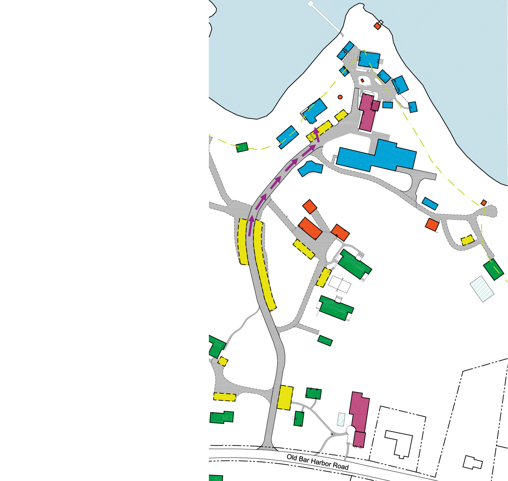

# Arrival 

## Welcome to MDI Biological Laboratory!

The course will be held on the second floor of the **Maine Center for Biomedical Innovation** (MCBI). This will be the second building on your left as you walk towards the main campus. Please [**email us**](mailto:CGDS@mdibl.org) if you are having trouble finding the MCBI. 

## Campus Map

## MCBI 

## Step-By-Step Guide

!!! success ""

    === "1. Parking"
        **Please park in the designated parking area along the main road.**
        

    === "2. Head Towards Main Campus"
        **Follow the main road down and to the right.**
        

    === "3. Enter the MCBI"
        **Enter the second building on the left.**
        

    === "4. Head Upstairs"
        **Go up the stariwell immediately on the left upon entering the MCBI.**
        

