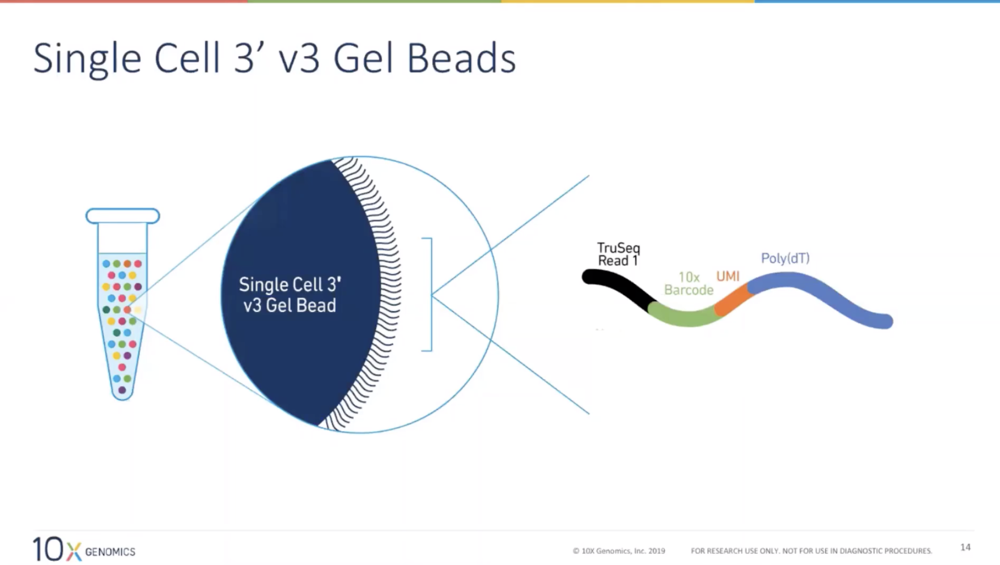
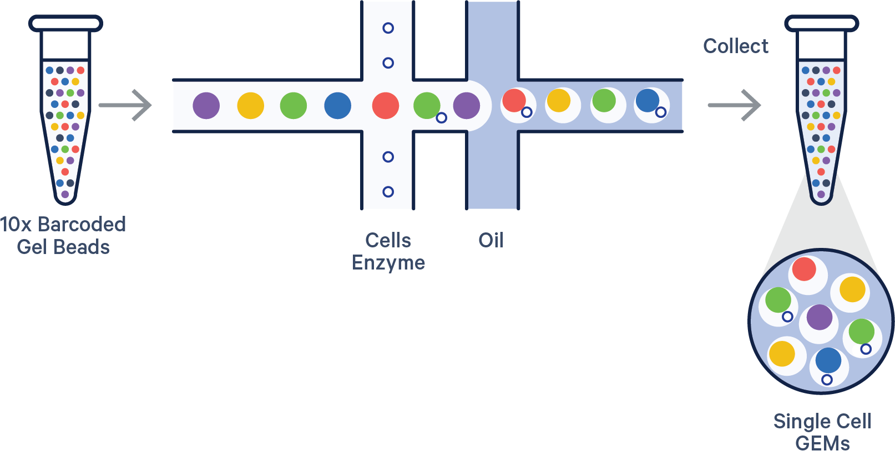
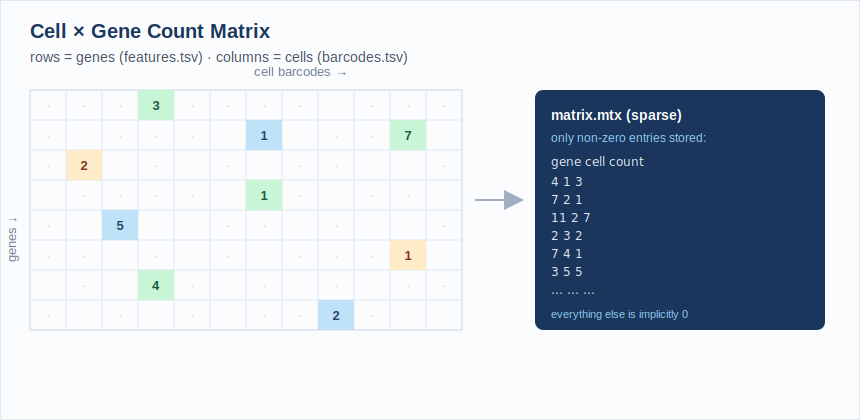
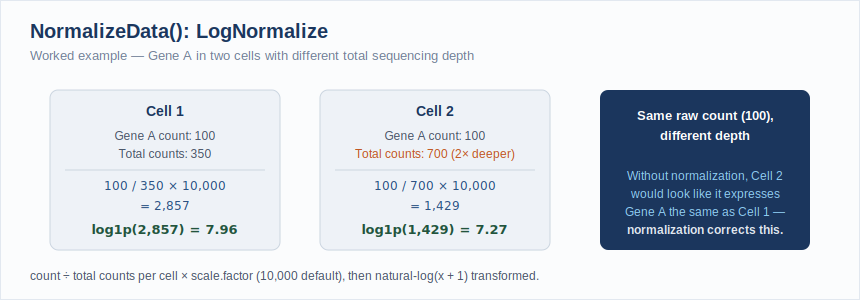
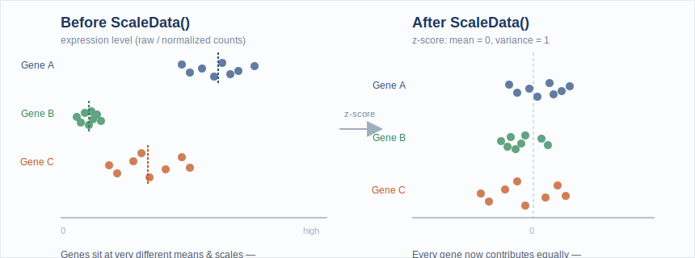
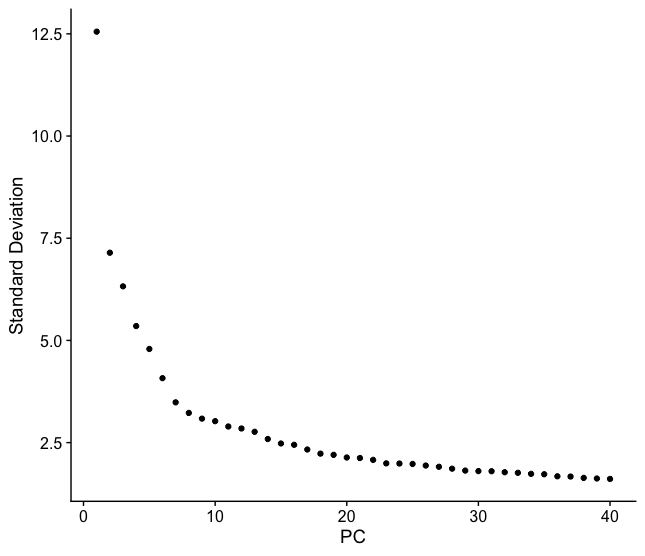
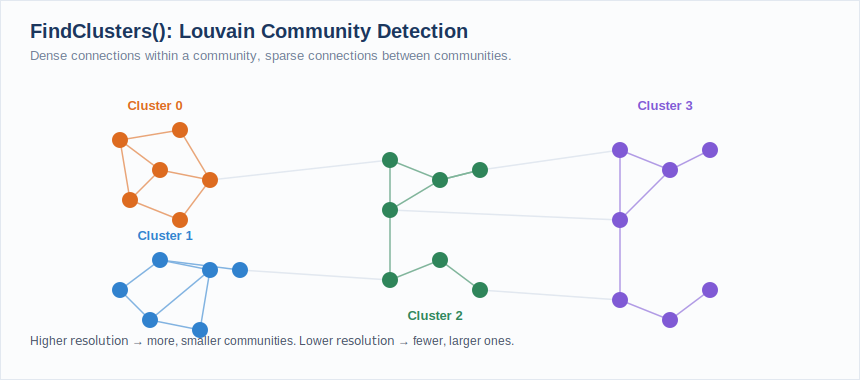
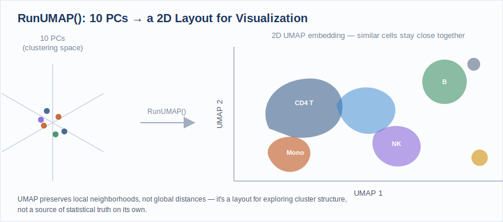

# Single Cell RNAseq

> **Workshop:** ~90 minutes hands-on &nbsp;·&nbsp; This page stays open for independent study and office-hours follow-up.

---

!!! info "Learning Objectives"
    By the end of this workshop you will be able to:

    - Understand single-cell sequencing technology and its underlying fundamentals
    - Interpret a single-cell expression matrix and understand its file structure
    - Build a Seurat object from barcode, feature, and matrix files

    **QC / Pre-processing**

    - Perform quality control on a Seurat object: score mitochondrial content and choose your own thresholds to filter low-count cells and flag potential doublets
    - Evaluate the effect of your QC choices by comparing metrics before and after filtering
    - Log-normalize and scale expression data in preparation for dimensionality reduction

    **Post-processing**

    - Reduce dimensionality with PCA, choose an appropriate number of principal components from an elbow plot, and construct a k-nearest neighbor (KNN) graph
    - Cluster cells with the Louvain algorithm and visualize results with UMAP/t-SNE

    **Cell Type Annotation**

    - Research marker genes for an assigned cluster using primary literature and databases, and propose a cell type identity with supporting evidence

Single-cell RNA sequencing (scRNA-seq) resolves gene expression at the level of individual cells, revealing the diversity of cell types and states within a tissue that bulk RNA-seq would average together. It has become a foundational tool for mapping cell atlases, characterizing tumor microenvironments, and studying development.

In this workshop you will work with a processed single-cell dataset, learn how the cell × gene matrix differs from bulk data, perform quality control and normalization, cluster cells into groups, and identify cell types from marker genes, all visualized through UMAP embeddings.

## How Single-Cell Sequencing Works

Before any analysis begins, individual cells have to be physically isolated and tagged so that every read can be traced back to the cell it came from. The 10x Genomics Chromium platform (the source of this workshop's dataset) does this with **droplet microfluidics**.

Each cell is paired with a single **gel bead** carrying millions of copies of a DNA oligo. Every oligo on a given bead shares the same **10x cell barcode**, but has a different random **UMI (Unique Molecular Identifier)** and a poly(dT) tail that captures mRNA:

<figure>

<figcaption>Every oligo on one gel bead shares the same 10x Barcode but a unique UMI. This is what lets reads be traced back to their cell of origin and de-duplicated to individual RNA molecules. Source: 10x Genomics.</figcaption>
</figure>

A microfluidic chip then merges one cell, one gel bead, and oil at a T-junction, encapsulating them together in a nanoliter droplet called a **GEM** (Gel bead-in-EMulsion):

<figure>

<figcaption>Barcoded gel beads, cells, and oil meet at a microfluidic junction. Poisson loading keeps most droplets empty or single-occupancy; a small fraction end up with two cells, which is where doublets come from (see QC below). Source: 10x Genomics.</figcaption>
</figure>

The clip below is real microscopy footage of that junction: each droplet pinching off is one GEM, and (ideally) one cell, forming in real time:

<figure>

<figcaption>Droplet generation at the microfluidic junction. Once a cell lyses inside its droplet, its mRNA hybridizes to the bead's oligos, tagging every transcript with that cell's barcode before sequencing.</figcaption>
</figure>

Downstream, Cell Ranger uses the shared barcode to group reads by cell of origin and the UMI to collapse PCR duplicates into a single molecule count, which is exactly what becomes the rows and columns of the count matrix in Part 1.

## Prerequisites

- Completion of the [Introduction to Data Science](../introDataScience/index.md) series, or equivalent R experience
- Recommended: [Differential Gene Expression (Bulk RNAseq)](../bulkDGE/index.md)

---

## Launch Your Workspace

!!! info "You need a free GitHub account to use this workshop"
    This workshop runs in **GitHub Codespaces**, a cloud environment that requires a GitHub account. If you do not have one, create one for free at [github.com](https://github.com) before the session. No paid plan is required.

    **GitHub Free quota (per account, per month):**

    - 120 core-hours of compute, equivalent to **60 hours** of run time on a standard 2-core Codespace
    - 15 GB of storage

    This is enough for workshops and occasional use, but is **not intended to replace a local development environment** for everyday work.

This workshop runs entirely in a cloud environment: no software installation required. One click opens a pre-configured RStudio session with Seurat and all required packages installed.

<div style="margin: 1.2rem 0;">
<a href="https://codespaces.new/mdibl/mdibl.github.io?devcontainer_path=.devcontainer%2Fsingle-cell%2Fdevcontainer.json" target="_blank">
  
</a>
</div>

!!! info "First launch takes several minutes"
    The first time the Codespace builds, GitHub installs Seurat and its dependencies. Subsequent launches are instant.

**What you'll see:**

1. GitHub opens a VS Code editor in your browser, this is the Codespace container. You do not need to use VS Code for this workshop.
2. A browser tab for **RStudio** will open automatically at port 8787. No login is required.
3. If RStudio does not open automatically: in VS Code, click the **Ports** tab at the bottom panel, find port `8787`, and click the globe icon to open it in a new tab.

!!! tip "Keep your Codespace awake, and stop it when you're done"
    Codespaces automatically pause after **30 minutes of inactivity**, but suspended Codespaces still consume your monthly storage quota. **Closing the browser tab does not stop the Codespace.**

    **At the start of the workshop**, open a new terminal tab in VS Code (**Terminal → New Terminal**) and run this keepalive loop:

    ```bash
    while true; do echo "keepalive $(date)"; sleep 300; done
    ```

    This pings the Codespace every 5 minutes to prevent it from suspending during the session.

!!! danger "How to stop your Codespace *when you're done*"

    1. Switch to the VS Code terminal tab where the `keepalive` loop is running.
    2. Press **Ctrl+C** to stop it.
    3. Go to [github.com/codespaces](https://github.com/codespaces), find your Codespace, click `···`, and select **Stop codespace**.

    ***Closing the browser tab is not enough: a suspended Codespace still counts against your monthly storage quota.***

**Getting oriented in RStudio:**

Once RStudio is open, get the workshop files ready:

1. In the **Files** pane (bottom-right), you will see the workshop directory. Click `scRNAseq.Rproj` to open the project, this sets your working directory correctly so data paths in the script will resolve.
2. Open `workshop.Rmd` (File → Open File, or click it in the Files pane). This is the file you will work through during the workshop.
3. Each grey block is a code chunk. Run a chunk by clicking the **▶ Run Current Chunk** button (green play icon at the top-right of the chunk), or press **Ctrl+Shift+Enter** (Windows/Linux) / **Cmd+Shift+Return** (Mac).

!!! tip "Save your work"
    Press **Ctrl+S** / **Cmd+S** often. At the end of the session, use the **Files** pane → More → Export to download your completed notebook to your computer before closing the Codespace.

---

## About This Dataset

!!! abstract "10x Genomics PBMC 3k: Seurat Guided Clustering Tutorial"
    **Source:** [10x Genomics](https://www.10xgenomics.com/), Peripheral Blood Mononuclear Cells (PBMC), 2,700 single cells sequenced on the Illumina NextSeq 500
    **Data download:** [`pbmc3k_filtered_gene_bc_matrices.tar.gz`](https://cf.10xgenomics.com/samples/cell/pbmc3k/pbmc3k_filtered_gene_bc_matrices.tar.gz)
    **Template:** This workshop follows the structure of the Seurat [**Guided Clustering Tutorial (pbmc3k)**](https://satijalab.org/seurat/articles/pbmc3k_tutorial), developed and maintained by the **Satija Lab and collaborators**.

This dataset and analysis walkthrough is one of the most widely used entry points to single-cell analysis. The workshop exercises mirror its structure (quality control and filtering, log-normalization, variable feature selection, scaling, PCA, graph-based (Louvain) clustering, UMAP visualization), but the QC thresholds, PC cutoff, and final cell type annotation are yours to determine, not given to you.

**Citing Seurat:** if you use Seurat in your own research, cite the paper corresponding to the version you use:

- Hao, Y. et al. ["Dictionary learning for integrative, multimodal and scalable single-cell analysis."](https://doi.org/10.1038/s41587-023-01767-y) *Nature Biotechnology* (2023), Seurat v5
- Hao\*, Hao\*, et al. ["Integrated analysis of multimodal single-cell data."](https://doi.org/10.1016/j.cell.2021.04.048) *Cell* (2021), Seurat v4
- Stuart\*, Butler\*, et al. ["Comprehensive Integration of Single-Cell Data."](https://doi.org/10.1016/j.cell.2019.05.031) *Cell* (2019), Seurat v3

!!! tip "Acknowledgement"
    Dataset courtesy of 10x Genomics. Tutorial structure and analysis workflow adapted from the Seurat project ([satijalab.org/seurat](https://satijalab.org/seurat/)), developed by the Satija Lab and collaborators.

---

## Part 1: QC & Pre-processing

### Load packages

Open `workshop.Rmd` and run the **Setup** chunk. This loads all packages and confirms the working directory is set correctly by `scRNAseq.Rproj`.

```r
library(Seurat)
library(patchwork)
library(dplyr)
library(ggplot2)

getwd()  # should end in .../docs/scRNAseq
```

### What is a single-cell expression matrix?

Instead of one column per sample (as in bulk RNA-seq), a single-cell count matrix has **one column per cell** and **one row per gene**, thousands of columns instead of a handful. Each value is the number of UMIs (unique molecular identifiers) for that gene detected in that cell. The vast majority of entries are zero, since any one cell only expresses a fraction of the genome, so Seurat stores the matrix in **sparse format** to save memory.

<figure>

<figcaption>Most cell/gene pairs are zero, so only the non-zero entries are stored, as (gene, cell, count) triplets; this is the MatrixMarket (.mtx) format Cell Ranger outputs.</figcaption>
</figure>

The `Read10X()` function expects a directory containing three files, the standard output of the [Cell Ranger](https://support.10xgenomics.com/single-cell-gene-expression/software/pipelines/latest/what-is-cell-ranger) pipeline:

| File | Contents |
|---|---|
| `barcodes.tsv.gz` | One cell barcode per line (the column names of the matrix) |
| `features.tsv.gz` | One gene per line (ID + symbol), the row names of the matrix |
| `matrix.mtx.gz` | The sparse count matrix itself, in MatrixMarket format |

---

???+ question "Exercise 1.1: Load the data and build a Seurat object"

    Run the **Exercise 1** chunk in `workshop.Rmd`:

    ```r
    pbmc.data <- Read10X(data.dir = "data/pbmc3k/filtered_gene_bc_matrices/hg19/")
    pbmc <- CreateSeuratObject(counts = pbmc.data, project = "pbmc3k", min.cells = 3, min.features = 200)
    pbmc
    ```

    `min.cells = 3` drops genes detected in fewer than 3 cells; `min.features = 200` drops cells with fewer than 200 detected genes, a first, coarse pass at removing empty droplets and background noise.

    **Questions:**

    1. How many cells (barcodes) came off the sequencer, and how many genes survive the `min.cells`/`min.features` filter?
    2. Why filter genes and cells before you've even looked at the data?

??? success "Solution"

    ```r
    pbmc.data <- Read10X(data.dir = "data/pbmc3k/filtered_gene_bc_matrices/hg19/")
    pbmc <- CreateSeuratObject(counts = pbmc.data, project = "pbmc3k", min.cells = 3, min.features = 200)
    pbmc
    # An object of class Seurat
    # 13714 features across 2700 samples within 1 assay
    # Active assay: RNA (13714 features, 0 variable features)
    ```

    The raw matrix has 32,738 genes × 2,700 cells. After the `min.cells`/`min.features` filter, 13,714 genes remain (genes never detected in at least 3 cells carry no information); all 2,700 cells are still present at this stage. `min.features = 200` is a very permissive floor, mainly there to drop obviously empty droplets before real QC begins.

---

### QC and selecting cells for further analysis

Three metrics distinguish a real cell from an empty droplet, background noise, or a doublet:

- **`nFeature_RNA`**: the number of unique genes detected in a cell. Too low → empty droplet or a dying cell; abnormally high → possibly two cells captured in one droplet (a **doublet**).
- **`nCount_RNA`**: total UMIs detected in a cell (correlates with `nFeature_RNA`).
- **`percent.mt`**: the percentage of a cell's reads that map to mitochondrial genes. Dying or lysed cells leak cytoplasmic RNA but retain mitochondrial RNA, so a high `percent.mt` flags low-quality cells.

`PercentageFeatureSet()` computes the mitochondrial percentage by summing counts for every gene matching a pattern: human mitochondrial genes are conventionally prefixed `MT-`.

---

???+ question "Exercise 1.2: Score mitochondrial content and visualize QC metrics"

    Run the **Exercise 2** chunk in `workshop.Rmd`:

    ```r
    pbmc[["percent.mt"]] <- PercentageFeatureSet(pbmc, pattern = "^MT-")

    VlnPlot(pbmc, features = c("nFeature_RNA", "nCount_RNA", "percent.mt"), ncol = 3)

    plot1 <- FeatureScatter(pbmc, feature1 = "nCount_RNA", feature2 = "percent.mt")
    plot2 <- FeatureScatter(pbmc, feature1 = "nCount_RNA", feature2 = "nFeature_RNA")
    plot1 + plot2
    ```

    **Questions:**

    1. What is the median `percent.mt` across cells? Are there outlier cells with very high mitochondrial content?
    2. In the `nCount_RNA` vs `nFeature_RNA` scatter plot, what would a cell sitting well above the main trend line (high count, disproportionately high feature number) suggest?
    3. **Look closely at these plots, you'll use them to make real decisions in the next exercise.** Where do the bulk of cells sit? Where do the tails start?

??? success "Solution"

    ```r
    pbmc[["percent.mt"]] <- PercentageFeatureSet(pbmc, pattern = "^MT-")
    summary(pbmc$percent.mt)
    #    Min. 1st Qu.  Median    Mean 3rd Qu.    Max.
    #   0.000   1.537   2.031   2.217   2.643  22.569
    ```

    Median `percent.mt` is ~2%, typical for healthy PBMCs; most cells sit in a tight, low band. A handful of cells reach up into the teens and twenties, that's the tail you'll need to decide what to do with next.

    A cell far above the main `nCount_RNA` vs `nFeature_RNA` trend (more total UMIs than its gene count would predict) is one of the signals used to flag potential **doublets**: two cells' worth of transcripts captured under one barcode.

---

### Filtering low-quality cells and doublets

There is no universal cutoff for `nFeature_RNA` or `percent.mt`. Every dataset's distribution is different, and the "right" thresholds are a judgment call you make by looking at the plots from Exercise 1.2, not a number you memorize. In general you're looking for:

- A **lower bound on `nFeature_RNA`** that excludes the low-complexity tail (empty droplets, dying cells) without cutting into the main population
- An **upper bound on `nFeature_RNA`** near the top of the distribution, as a proxy for doublets: a cell registering an unusually large number of unique genes is more likely to be two cells captured under one barcode than one unusually complex cell
- An **upper bound on `percent.mt`** that excludes the high-mitochondrial tail (dying/lysed cells) without discarding legitimately active cells

!!! tip "Setting thresholds in practice"
    Dedicated doublet-detection tools (e.g. `scDblFinder`, `DoubletFinder`) formalize the upper `nFeature_RNA` bound further, but for this workshop you'll set all three thresholds by eye. Be ready to justify your choice: what would happen to your dataset if you moved the `percent.mt` cutoff from 5% to 20%? From 5% to 2%?

---

???+ question "Exercise 1.3: Choose your own QC thresholds and filter"

    Run the **Exercise 3** chunk in `workshop.Rmd`, but first replace the placeholder values with your own, chosen from the Exercise 1.2 plots:

    ```r
    min_features   <- ___   # lower bound on nFeature_RNA
    max_features   <- ___   # upper bound on nFeature_RNA (your doublet proxy)
    max_percent_mt <- ___   # upper bound on percent.mt

    pbmc <- subset(
      pbmc,
      subset = nFeature_RNA > min_features & nFeature_RNA < max_features & percent.mt < max_percent_mt
    )
    pbmc
    ```

    **Questions:**

    1. What values did you choose, and why? Point to a specific feature of the distribution (a gap, a tail, a knee in the curve) that justifies each one.
    2. How many cells did your thresholds remove?
    3. Compare with a classmate who chose different values. How different were your final cell counts? Whose thresholds were more permissive?
    4. Which of your three criteria removed the most cells?

??? tip "There's no answer key, but a sanity check"
    Most published PBMC analyses land somewhere in the neighborhood of `nFeature_RNA` between roughly 200 and 2,500, with `percent.mt` below 5-10%, but the right values always depend on the shape of *your* distributions, not a memorized number. If your thresholds remove more than ~20-30% of cells, revisit the plots; you may be cutting into the healthy population instead of trimming a tail.

---

### Seeing what filtering actually changed

Filtering doesn't just shrink a table, it changes the shape of your data. Re-running the same QC plots on the filtered object makes that concrete, and lets you check your own work.

---

???+ question "Exercise 1.4: Re-visualize QC metrics after filtering"

    Run the **Exercise 4** chunk in `workshop.Rmd`: the same plotting calls as Exercise 1.2, now on your filtered `pbmc` object.

    ```r
    VlnPlot(pbmc, features = c("nFeature_RNA", "nCount_RNA", "percent.mt"), ncol = 3)

    plot1 <- FeatureScatter(pbmc, feature1 = "nCount_RNA", feature2 = "percent.mt")
    plot2 <- FeatureScatter(pbmc, feature1 = "nCount_RNA", feature2 = "nFeature_RNA")
    plot1 + plot2
    ```

    **Questions:**

    1. Scroll up and compare these plots side-by-side with your Exercise 1.2 plots. What changed, and what stayed the same?
    2. Did the tails get clipped, or did the whole distribution shift? What would it mean if the *entire* distribution had shifted rather than just the extremes?
    3. If a classmate used looser thresholds than you, would you expect their post-filtering violin plots to look different from yours? How?

??? success "What to look for"
    The clearest change is usually the top of the `nFeature_RNA` and `percent.mt` violins getting clipped flat right at your chosen cutoffs, the long tail is gone. The bulk of the distribution, where most cells sit, should look nearly identical to before, since your thresholds were chosen specifically to avoid touching it. If the whole distribution moved rather than just the tails, that's a sign your cutoffs were more aggressive than intended.

---

### Normalizing the data

Just as with bulk RNA-seq, raw UMI counts aren't directly comparable across cells: different cells capture different total numbers of transcripts due to technical variation in droplet capture efficiency, not biology. Seurat's default **`LogNormalize`** method:

1. Divides each gene's count in a cell by that cell's total counts (library-size normalization)
2. Multiplies by a scale factor (`10,000` by default)
3. Log1p-transforms the result

```r
pbmc <- NormalizeData(pbmc, normalization.method = "LogNormalize", scale.factor = 1e4)
```

<figure>

<figcaption>Two cells can have the identical raw count for a gene and still differ purely because one was sequenced more deeply. Dividing by each cell's total counts before comparing removes that technical difference.</figcaption>
</figure>

### Identifying highly variable features

Most genes are either uninformative "housekeeping" genes (similar expression everywhere) or too lowly expressed to be useful. `FindVariableFeatures()` models the mean–variance relationship across all genes and returns the subset that varies the most *beyond* what expression level alone would predict, by default the top 2,000. Downstream steps (scaling, PCA) focus on these features so that biological signal isn't drowned out by uninformative genes.

---

???+ question "Exercise 1.5: Normalize and find variable features"

    Run the **Exercise 5** chunk in `workshop.Rmd`:

    ```r
    pbmc <- NormalizeData(pbmc, normalization.method = "LogNormalize", scale.factor = 1e4)
    pbmc <- FindVariableFeatures(pbmc, selection.method = "vst", nfeatures = 2000)

    top10 <- head(VariableFeatures(pbmc), 10)

    plot1 <- VariableFeaturePlot(pbmc)
    LabelPoints(plot = plot1, points = top10, repel = TRUE)
    ```

    **Questions:**

    1. What are the top 10 most variable genes? Do any look biologically familiar (hint: platelets, granulocytes)?
    2. On the variable feature plot, where do the top genes sit relative to the mean-expression trend line?

??? success "Solution"

    ```r
    top10 <- head(VariableFeatures(pbmc), 10)
    top10
    #  [1] "PPBP"   "LYZ"    "S100A9" "IGLL5"  "GNLY"   "FTL"    "PF4"    "FTH1"
    #  [9] "GNG11"  "S100A8"
    ```

    (Your exact list may differ slightly depending on which cells passed your QC filter in Exercise 1.3.) `PPBP` and `PF4` are platelet markers, `LYZ`/`S100A9`/`S100A8` are myeloid/monocyte markers, and `GNLY` marks NK/cytotoxic cells; this list is already hinting at the distinct cell populations we'll recover with clustering later. Highly variable genes sit **above** the mean-variance trend line: for their average expression level, they show more cell-to-cell variance than expected by chance.

---

### Scaling the data

`ScaleData()` linearly transforms each gene so that, across cells, it has **mean 0** and **variance 1** (a z-score). This is standard practice before PCA: without it, highly-expressed genes would dominate the principal components purely because of their expression magnitude rather than their biological signal.

```r
all.genes <- rownames(pbmc)
pbmc <- ScaleData(pbmc, features = all.genes)
```

<figure>

<figcaption>Before scaling, genes sit at very different means and spreads; after scaling, every gene is centered at 0 with unit variance, so no single gene can dominate PCA just by being highly expressed.</figcaption>
</figure>

---

???+ question "Exercise 1.6: Scale the data"

    Run the **Exercise 6** chunk in `workshop.Rmd`:

    ```r
    all.genes <- rownames(pbmc)
    pbmc <- ScaleData(pbmc, features = all.genes)
    ```

    **Question:** By default, `ScaleData()` only needs to be run on variable features for PCA to work; why scale `all.genes` here instead?

??? success "Solution"

    Scaling all genes (rather than just the 2,000 variable features) means the resulting `scale.data` slot can also be used later for visualizations like `DoHeatmap()` across any gene of interest, not just the ones used for PCA. It costs more compute but keeps the object flexible for downstream exploration.

    !!! tip "Removing unwanted variation"
        `ScaleData(pbmc, vars.to.regress = "percent.mt")` can regress out a covariate like mitochondrial content directly during scaling, useful when a technical factor is confounding biological signal you care about.

---

## Part 2: Post-processing

### Perform linear dimensional reduction (PCA)

With scaled data in hand, `RunPCA()` computes principal components using the variable features. Each PC is a linear combination of genes (a "metafeature" summarizing a correlated expression pattern across cells), and the first several PCs typically capture the dominant axes of biological variation (here, differences between immune cell types).

```r
pbmc <- RunPCA(pbmc, features = VariableFeatures(object = pbmc))
```

<figure>

<figcaption>PCA compresses thousands of correlated gene measurements down to a handful of components. Cell type identity is already visible along the first couple of PCs, well before clustering or UMAP.</figcaption>
</figure>

---

???+ question "Exercise 2.1: Run and visualize PCA"

    Run the **Exercise 7** chunk in `workshop.Rmd`:

    ```r
    pbmc <- RunPCA(pbmc, features = VariableFeatures(object = pbmc))

    print(pbmc[["pca"]], dims = 1:5, nfeatures = 5)
    VizDimLoadings(pbmc, dims = 1:2, reduction = "pca")
    DimPlot(pbmc, reduction = "pca") + NoLegend()
    ```

    **Question:** Looking at the top genes loading PC1, can you guess which cell populations it's separating?

??? success "Solution"

    PC1's top positive/negative loadings are dominated by myeloid genes (`LYZ`, `CST3`, `S100A8/9`) on one end and lymphocyte genes (`CD3`-family, `IL7R`) on the other: PC1 is primarily separating **myeloid cells (monocytes/DCs) from lymphocytes (T/B/NK cells)**, the single largest axis of variation in PBMCs.

---

### Determining the dimensionality of the dataset

Not every PC captures real signal; later PCs are increasingly dominated by noise. An **elbow plot** ranks PCs by the percentage of variance they explain; the "elbow" (where the curve flattens) is a heuristic for how many PCs carry real signal. Exactly where that elbow is, and how many PCs you decide to carry forward, is your call.

<figure>

<figcaption>Standard deviation explained per PC. Diminishing biological signal in later PCs shows up as the curve flattening out (the "elbow"). This example is output from the CGDS Core's internal scRNA-seq pipeline; your own elbow plot will look similar but not identical, since it depends on your QC thresholds from Part 1.</figcaption>
</figure>

---

???+ question "Exercise 2.2: Choose your number of PCs"

    Run the **Exercise 8** chunk in `workshop.Rmd`:

    ```r
    ElbowPlot(pbmc, ndims = 30)

    n_pcs <- ___   # pick your own cutoff based on the elbow plot above
    ```

    Store your choice in `n_pcs`. Every remaining step in this workshop (`FindNeighbors()`, `RunUMAP()`) uses `dims = 1:n_pcs`, so this single choice propagates through the rest of your analysis, don't change it later without re-running everything downstream.

    **Questions:**

    1. Where does the curve flatten out for you? Is there one obvious elbow, or a plausible range?
    2. The Seurat authors note that erring on the higher side rarely hurts (the difference between 10, 15, or 20 PCs is usually small), but using only 5 does noticeably degrade results. Does your choice reflect that advice?
    3. If you're torn between two values, which do you pick, and why?

??? tip "No fixed answer, but a reference point"
    Using close-to-default QC thresholds, a common choice for this dataset lands around PC 9-10, but your own elbow plot will shift slightly depending on the QC cutoffs you chose in Part 1. Pick a number, write down why, and commit to it for the rest of the workshop.

---

### Cluster the cells

Seurat clusters cells using a **graph-based** approach rather than a classic method like k-means:

1. **`FindNeighbors()`** builds a **k-nearest neighbor (KNN) graph** in PCA space, connecting each cell to its most similar neighbors by Euclidean distance on the chosen PCs, then refines edge weights by the *shared* overlap between neighborhoods (Jaccard similarity), producing a shared nearest neighbor (SNN) graph.
2. **`FindClusters()`** partitions that graph into communities using the **Louvain algorithm** (the default modularity-optimization method), which iteratively groups cells to maximize the density of connections within clusters relative to between them.

The `resolution` parameter controls granularity, higher values produce more, smaller clusters. `0.4–1.2` is the typical useful range for a dataset of a few thousand cells.

<figure>

<figcaption>FindNeighbors() connects each cell to its nearest neighbors in PCA space, forming the graph that Louvain clustering will later partition.</figcaption>
</figure>

<figure>

<figcaption>Louvain clustering finds communities with dense internal connections and sparse connections to other communities: each community becomes a numbered cluster.</figcaption>
</figure>

---

???+ question "Exercise 2.3: Build the KNN graph and cluster with Louvain"

    Run the **Exercise 9** chunk in `workshop.Rmd`, using the `n_pcs` you chose in Exercise 2.2:

    ```r
    pbmc <- FindNeighbors(pbmc, dims = 1:n_pcs)
    pbmc <- FindClusters(pbmc, resolution = 0.5)

    head(Idents(pbmc), 5)
    table(Idents(pbmc))
    ```

    **Questions:**

    1. How many clusters do you get, and how many cells fall in the smallest one?
    2. What happens if you try `resolution = 0.1` or `resolution = 1.5`? (Try it and re-run `table(Idents(pbmc))`.)
    3. Compare your cluster count with a classmate who chose a different `n_pcs` or different QC thresholds. Who has more clusters? Any guesses why?

??? example "One reference run (10 PCs, QC thresholds 200/2500/5%, resolution 0.5)"

    ```r
    pbmc <- FindNeighbors(pbmc, dims = 1:10)
    pbmc <- FindClusters(pbmc, resolution = 0.5)
    table(Idents(pbmc))
    #   0   1   2   3   4   5   6   7   8
    # 684 481 476 344 291 162 155  32  13
    ```

    This particular combination of choices produces **9 clusters**, ranging from 684 cells down to a rare population of just 13. Your own numbers will differ: lowering resolution merges related clusters together (fewer, larger groups); raising it splits them further (more, smaller groups); different `n_pcs` and QC thresholds shift things further still. There is no single "correct" answer, only one appropriate to how finely you want to distinguish cell states and how you chose to filter your data.

---

### Run non-linear dimensional reduction (UMAP)

PCA and clustering happen in high-dimensional space (your chosen `n_pcs`); **UMAP** compresses that structure into 2D for visualization, aiming to keep cells that are close together in the KNN graph close together on the plot. It's a visualization tool, not a source of biological truth on its own; conclusions should rest on the clustering and marker analysis, not the UMAP layout alone.

```r
pbmc <- RunUMAP(pbmc, dims = 1:n_pcs)
```

<figure>

<figcaption>UMAP folds the high-dimensional PCA space down to 2D, keeping cells that were close neighbors near each other: related T cell subsets sit close together while monocytes, B cells, and other distinct types form separate islands.</figcaption>
</figure>

---

???+ question "Exercise 2.4: Run UMAP"

    Run the **Exercise 10** chunk in `workshop.Rmd`:

    ```r
    pbmc <- RunUMAP(pbmc, dims = 1:n_pcs)
    DimPlot(pbmc, reduction = "umap")
    ```

    **Question:** Do the clusters from `FindClusters()` form visually distinct islands on the UMAP plot, or do some blend together?

??? success "What to look for"

    The large lymphocyte clusters (naive/memory CD4+ T, CD8+ T) tend to sit close together with soft boundaries (reflecting real biological similarity between T cell subsets), while monocyte, B, NK, and platelet clusters typically form clearly separated islands. Overlap on the UMAP between two clusters doesn't mean the clustering was wrong; it reflects a continuum of similar transcriptional states.

---

## Part 3: Cluster Marker Research Assignment

Clusters are just numbers until you connect them to biology, and unlike the earlier steps in this workshop, there's no shortcut here: real annotation requires reading about real genes. Because everyone chose their own QC thresholds and `n_pcs`, **your clusters are not the same as your classmates'**: this assignment is based on your own results, not a shared answer key.

### Find all cluster marker genes

`FindAllMarkers()` runs differential expression for every cluster against all other cells and reports the genes that best distinguish each one.

```r
pbmc.markers <- FindAllMarkers(pbmc, only.pos = TRUE)

pbmc.markers %>%
  group_by(cluster) %>%
  dplyr::filter(avg_log2FC > 1) %>%
  slice_head(n = 10) %>%
  ungroup()
```

---

???+ question "Exercise 3.1: Annotate your assigned cluster"

    **Your instructor will assign you one cluster number from your own results.**

    1. Pull the top marker genes for your assigned cluster specifically. Run the **Exercise 12** chunk in `workshop.Rmd`:

        ```r
        my_cluster <- ___   # the cluster number your instructor assigned you

        FindMarkers(pbmc, ident.1 = my_cluster) %>%
          filter(pct.1 > 0.25) %>%   # expressed in a meaningful fraction of the cluster, not just a couple of cells
          arrange(desc(avg_log2FC)) %>%
          head(15)
        ```

        !!! warning "Watch out for noise genes"
            If you sort by `avg_log2FC` without filtering on `pct.1` (the fraction of cells in your cluster expressing the gene) first, you'll often get genes detected in only 1-2% of cells with huge fold changes, statistically "significant" but not real markers of anything. A gene expressed in <10% of your cluster isn't a useful marker, no matter how large its fold change.

    2. Pick the 3-5 genes with the highest `avg_log2FC` and lowest `p_val_adj`. Research each one using at least one of:

        - [GeneCards](https://www.genecards.org/)
        - [The Human Protein Atlas](https://www.proteinatlas.org/)
        - [PubMed](https://pubmed.ncbi.nlm.nih.gov/) (search the gene symbol plus "PBMC" or "immune cell")
        - [CellMarker 2.0](http://bio-bigdata.hrbmu.edu.cn/CellMarker/)

    3. Sanity-check your candidate genes against your cluster visually:

        ```r
        my_genes <- c("GENE1", "GENE2", "GENE3")  # substitute your chosen genes

        VlnPlot(pbmc, features = my_genes)
        FeaturePlot(pbmc, features = my_genes)
        ```

    4. Write a short paragraph (3-5 sentences) proposing a cell type identity for your cluster. Cite at least one source, and state your confidence: is this a well-known canonical marker, or a more ambiguous call?

    **Come prepared to present:** your cluster number, your top marker genes, your proposed cell type, and the evidence that convinced you.

!!! info "PBMCs contain a known, limited set of cell types"
    To narrow your search: peripheral blood mononuclear cells are overwhelmingly composed of T cells (multiple subsets), B cells, monocytes, NK cells, dendritic cells, and platelets. You don't need to consider rare or exotic cell types, but you do need to determine *which* of these your cluster is, and ideally which subset.

### Finalizing the annotation as a class

Once everyone has presented, agree on a label for each cluster as a group and apply them together:

```r
new.cluster.ids <- c("your", "class's", "agreed", "labels", "in", "cluster", "order")  # extend/edit to match your clusters
names(new.cluster.ids) <- levels(pbmc)
pbmc <- RenameIdents(pbmc, new.cluster.ids)

DimPlot(pbmc, reduction = "umap", label = TRUE, pt.size = 0.5) + NoLegend()
```

## Further Reading

- [Seurat Guided Clustering Tutorial (pbmc3k)](https://satijalab.org/seurat/articles/pbmc3k_tutorial): the source tutorial this workshop is adapted from
- [Hao et al. 2023, *Nature Biotechnology*](https://doi.org/10.1038/s41587-023-01767-y): the Seurat v5 paper
- [Stuart\* & Butler\* et al. 2019, *Cell*](https://doi.org/10.1016/j.cell.2019.05.031): variable feature selection and anchor-based integration methodology
- [Macosko et al. 2015, *Cell*](https://doi.org/10.1016/j.cell.2015.05.002): Drop-seq and the graph-based clustering approach Seurat builds on
- [10x Genomics PBMC 3k Dataset](https://www.10xgenomics.com/): original data source

---

*Questions? Contact the CGDS Core: [CGDS@mdibl.org](mailto:CGDS@mdibl.org)*
