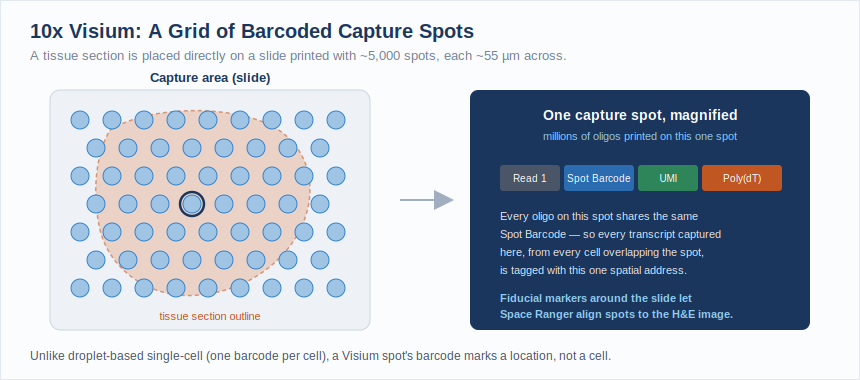
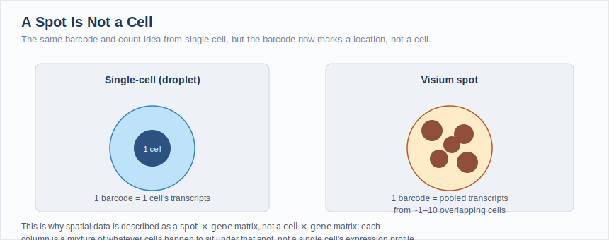
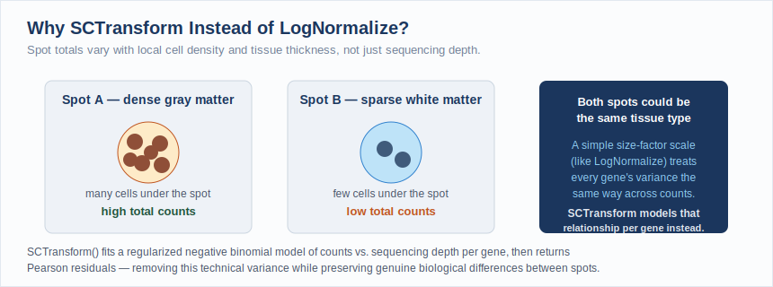
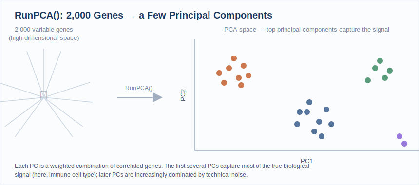
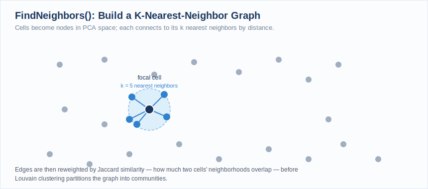
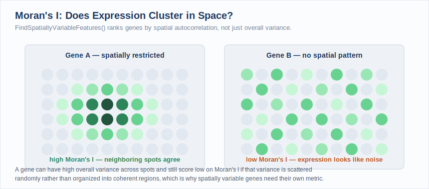

# Spatial Transcriptomics

!!! info "Coming soon: July 2026"
    This workshop is under development and will be available for the July 2026 workshop series. Check back closer to the session date for the full course page.

---

!!! info "Learning Objectives"
    By the end of this workshop you will be able to:

    - Understand 10x Visium spatial transcriptomics technology and how it differs from single-cell sequencing
    - Interpret a spot × gene expression matrix and understand how it relates to the tissue histology image
    - Load a Visium dataset into a Seurat object and inspect its structure

    **QC / Pre-processing**

    - Evaluate spatial QC metrics and recognize how tissue density (not just sequencing depth) drives spot-to-spot variation
    - Normalize spatial expression data with `SCTransform()` and explain why it is preferred over `LogNormalize()` for spatial data

    **Post-processing**

    - Reduce dimensionality with PCA, choose an appropriate number of principal components, and cluster spots with the Louvain algorithm
    - Visualize clusters both in UMAP space and overlaid on the tissue image, and compare the two

    **Spatially Variable Genes & Region Annotation**

    - Distinguish "highly variable" from "spatially variable": identify genes whose expression clusters in space using Moran's I
    - Research marker genes for an assigned cluster/region using primary literature and neuroanatomical references, and propose a tissue region identity with supporting evidence

Spatial transcriptomics captures gene expression while preserving the physical location of that expression within a tissue section, adding the dimension of space to a data type that scRNA-seq strips away. Where single-cell sequencing tells you *which* cell types exist, spatial transcriptomics tells you *where* they live relative to each other and to tissue architecture, information that is essential for understanding tumor microenvironments, developmental gradients, and organ structure.

In this workshop you will work with a 10x Visium dataset, learn how a spot × gene matrix differs from both bulk and single-cell data, normalize and cluster spots, and identify genes whose expression is organized in space rather than scattered at random, all visualized both on a UMAP plot and directly on the tissue image itself.

## How Spatial Transcriptomics Works

The 10x Genomics Visium platform (the source of this workshop's dataset) captures gene expression by placing a tissue section directly onto a slide printed with thousands of **barcoded capture spots**, rather than isolating individual cells first.

Each spot, about 55 µm across, carries millions of copies of a DNA oligo. Every oligo on a given spot shares the same **spot barcode**, but has a different random **UMI** and a poly(dT) tail that captures mRNA released from the tissue directly above it:

<figure>

<figcaption>A tissue section sits on a grid of barcoded spots. Every oligo on one spot shares the same Spot Barcode, tagging every transcript captured there with that spot's location. Fiducial markers around the capture area let downstream software align spots to the tissue image.</figcaption>
</figure>

This is the key difference from droplet-based single-cell: a barcode here marks a **location**, not a **cell**. A 55 µm spot typically sits under several cells at once, so its expression profile is a mixture of whatever cell types happen to be present at that spot:

<figure>

<figcaption>A droplet's barcode corresponds to one cell's transcripts. A Visium spot's barcode corresponds to the pooled transcripts of every cell overlapping that spot, this is why spatial data is a spot × gene matrix, not a cell × gene matrix.</figcaption>
</figure>

Downstream, Space Ranger uses the spot barcode to group reads by location, the UMI to collapse PCR duplicates, and the fiducial markers printed around the capture area to register every spot's exact pixel coordinates on the accompanying histology image, exactly what becomes the spatial coordinates behind every plot in Part 2.

## Prerequisites

- Completion of the [Introduction to Data Science](../introDataScience/index.md) series, or equivalent R experience
- Recommended: [Single Cell RNAseq](../scRNAseq/index.md), this workshop assumes familiarity with Seurat objects, normalization, PCA, and graph-based clustering, and moves quickly through steps that work identically to single-cell data

---

## Launch Your Workspace

!!! info "You need a free GitHub account to use this workshop"
    This workshop runs in **GitHub Codespaces**, a cloud environment that requires a GitHub account. If you do not have one, create one for free at [github.com](https://github.com) before the session. No paid plan is required.

    **GitHub Free quota (per account, per month):**

    - 120 core-hours of compute, equivalent to **60 hours** of run time on a standard 2-core Codespace
    - 15 GB of storage

    This is enough for workshops and occasional use, but is **not intended to replace a local development environment** for everyday work.

This workshop runs entirely in a cloud environment: no software installation required. One click opens a pre-configured RStudio session with Seurat, SeuratData, and the workshop's spatial dataset already installed.

<div style="margin: 1.2rem 0;">
<a href="https://codespaces.new/mdibl/mdibl.github.io?devcontainer_path=.devcontainer%2Fspatial%2Fdevcontainer.json" target="_blank">
  
</a>
</div>

!!! info "First launch takes several minutes"
    The first time the Codespace builds, GitHub installs Seurat, its dependencies, and downloads the Visium mouse brain dataset (a few hundred MB). Subsequent launches are instant.

**What you'll see:**

1. GitHub opens a VS Code editor in your browser, this is the Codespace container. You do not need to use VS Code for this workshop.
2. A browser tab for **RStudio** will open automatically at port 8787. No login is required.
3. If RStudio does not open automatically: in VS Code, click the **Ports** tab at the bottom panel, find port `8787`, and click the globe icon to open it in a new tab.

!!! tip "Keep your Codespace awake, and stop it when you're done"
    Codespaces automatically pause after **30 minutes of inactivity**, but suspended Codespaces still consume your monthly storage quota. **Closing the browser tab does not stop the Codespace.**

    **At the start of the workshop**, open a new terminal tab in VS Code (**Terminal → New Terminal**) and run this keepalive loop:

    ```bash
    while true; do echo "keepalive $(date)"; sleep 300; done
    ```

    This pings the Codespace every 5 minutes to prevent it from suspending during the session.

!!! danger "How to stop your Codespace *when you're done*"

    1. Switch to the VS Code terminal tab where the `keepalive` loop is running.
    2. Press **Ctrl+C** to stop it.
    3. Go to [github.com/codespaces](https://github.com/codespaces), find your Codespace, click `···`, and select **Stop codespace**.

    ***Closing the browser tab is not enough: a suspended Codespace still counts against your monthly storage quota.***

**Getting oriented in RStudio:**

Once RStudio is open, get the workshop files ready:

1. In the **Files** pane (bottom-right), you will see the workshop directory. Click `spatial.Rproj` to open the project, this sets your working directory correctly.
2. Open `workshop.Rmd` (File → Open File, or click it in the Files pane). This is the file you will work through during the workshop.
3. Each grey block is a code chunk. Run a chunk by clicking the **▶ Run Current Chunk** button (green play icon at the top-right of the chunk), or press **Ctrl+Shift+Enter** (Windows/Linux) / **Cmd+Shift+Return** (Mac).

!!! tip "Save your work"
    Press **Ctrl+S** / **Cmd+S** often. At the end of the session, use the **Files** pane → More → Export to download your completed notebook to your computer before closing the Codespace.

---

## About This Dataset

!!! abstract "10x Genomics Visium Mouse Brain (Sagittal, Anterior): Seurat Spatial Vignette"
    **Source:** [10x Genomics](https://www.10xgenomics.com/), sagittal mouse brain section, Visium v1 chemistry, distributed through the [`SeuratData`](https://github.com/satijalab/seurat-data) package as `stxBrain`
    **Template:** This workshop follows the structure of the Seurat [**Spatial Transcriptomics Vignette**](https://satijalab.org/seurat/articles/spatial_vignette), developed and maintained by the **Satija Lab and collaborators**.

This dataset pairs a spot × gene expression matrix with the H&E histology image it was captured from, and is one of the most widely used entry points to spatial analysis. The workshop exercises mirror the vignette's structure (loading spatial data, regularized normalization, PCA, graph-based (Louvain) clustering, spatial visualization, identifying spatially variable genes), but the number of PCs, clustering resolution, and final region annotation are yours to determine, not given to you, just as in the single-cell workshop.

**Citing Seurat:** if you use Seurat in your own research, cite the paper corresponding to the version you use:

- Hao, Y. et al. ["Dictionary learning for integrative, multimodal and scalable single-cell analysis."](https://doi.org/10.1038/s41587-023-01767-y) *Nature Biotechnology* (2023), Seurat v5
- Hao\*, Hao\*, et al. ["Integrated analysis of multimodal single-cell data."](https://doi.org/10.1016/j.cell.2021.04.048) *Cell* (2021), Seurat v4
- Stuart\*, Butler\*, et al. ["Comprehensive Integration of Single-Cell Data."](https://doi.org/10.1016/j.cell.2019.05.031) *Cell* (2019), Seurat v3

!!! tip "Acknowledgement"
    Dataset courtesy of 10x Genomics, distributed via `SeuratData`. Tutorial structure and analysis workflow adapted from the Seurat project ([satijalab.org/seurat](https://satijalab.org/seurat/)), developed by the Satija Lab and collaborators.

---

## Part 1: Loading Spatial Data & Pre-processing

### Load packages

Open `workshop.Rmd` and run the **Setup** chunk. This loads all packages and confirms the working directory is set correctly by `spatial.Rproj`.

```r
library(Seurat)
library(SeuratData)
library(patchwork)
library(dplyr)
library(ggplot2)

getwd()  # should end in .../docs/spatial
```

### What does a spatial Seurat object contain?

A spatial Seurat object holds the same kind of `Spatial` assay you'd recognize from single-cell (a spot × gene count matrix), plus two things a single-cell object doesn't have: the **histology image** and each spot's **pixel coordinates** on that image, stored in the object's `images` slot. Every plotting function in this workshop that starts with `Spatial…` (`SpatialFeaturePlot()`, `SpatialDimPlot()`) uses that slot to draw directly on the tissue.

---

???+ question "Exercise 1.1: Load the Visium dataset and inspect the Seurat object"

    Run the **Exercise 1** chunk in `workshop.Rmd`:

    ```r
    InstallData("stxBrain")
    brain <- LoadData("stxBrain", type = "anterior1")
    brain
    ```

    **Questions:**

    1. How many spots and genes are in this object? How does that compare in order of magnitude to the pbmc3k dataset from the single-cell workshop (2,700 cells)?
    2. Run `names(brain@images)`, what does this slot hold that a single-cell Seurat object doesn't?

??? success "Solution"

    ```r
    brain <- LoadData("stxBrain", type = "anterior1")
    brain
    # An object of class Seurat
    # 31053 features across 2696 samples within 1 assay
    # Active assay: Spatial (31053 features, 0 variable features)
    # 1 image present: anterior1
    ```

    This section has 2,696 spots, similar in order of magnitude to pbmc3k's 2,700 cells, but each "sample" here is a spot, not a cell. `brain@images` holds the histology image itself plus each spot's pixel coordinates and scale factors, this is what lets `SpatialFeaturePlot()` and `SpatialDimPlot()` draw expression directly onto the tissue picture.

---

### QC metrics for spatial data

The same two count-based metrics from single-cell carry over directly, just renamed for the `Spatial` assay:

- **`nCount_Spatial`**: total UMIs captured at a spot
- **`nFeature_Spatial`**: number of unique genes detected at a spot

But their *interpretation* changes. In single-cell, a low `nCount_RNA` often flags an empty droplet, and a high one can flag a doublet. A Visium spot is never empty of tissue (Space Ranger only keeps spots the software detects are under tissue) and a spot is never "two spots captured as one," so those particular explanations don't apply. Instead, spot-to-spot variation in these metrics is mostly driven by **local cell density and tissue morphology**: a spot sitting on dense gray matter or a cell body layer will show far higher counts than a spot on sparse white matter or ventricle space, independent of sequencing quality.

`SpatialFeaturePlot()` is the tool that makes this visible: instead of a violin plot alone, you can overlay a QC metric directly onto the tissue and see whether it tracks anatomy.

---

???+ question "Exercise 1.2: Visualize QC metrics on the violin plot and on the tissue itself"

    Run the **Exercise 2** chunk in `workshop.Rmd`:

    ```r
    plot1 <- VlnPlot(brain, features = "nCount_Spatial", pt.size = 0.1) + NoLegend()
    plot2 <- SpatialFeaturePlot(brain, features = "nCount_Spatial") + theme(legend.position = "right")
    plot1 + plot2
    ```

    **Questions:**

    1. On the violin plot alone, `nCount_Spatial` looks like a wide, somewhat skewed distribution. Does that skew look like a QC problem, once you see the spatial plot next to it?
    2. Do the highest and lowest `nCount_Spatial` spots form a scattered, random pattern on the tissue, or do they trace out recognizable anatomical structures?
    3. Given what Exercise 1.2 shows you, would blindly applying a single-cell-style `nCount` cutoff (e.g. "remove anything below the 10th percentile") risk removing a real tissue region rather than removing noise? Why or why not?

??? success "What to look for"

    The wide spread in the violin plot is almost entirely explained once you look at the spatial plot: high-count spots cluster tightly over what is visibly a dense cell body layer (a strip of tissue), while low-count spots sit over sparser tissue or the tissue's edges. This is the central lesson of spatial QC: variation that would look like a filtering problem in single-cell is often real anatomical signal here. A blind percentile-based cutoff could silently discard an entire tissue region rather than removing genuinely low-quality spots, this is why this workshop does not ask you to apply a hard QC filter the way the single-cell workshop did.

---

### Normalizing spatial data with SCTransform

`LogNormalize()` (the single-cell default) uses one scale factor per cell/spot: divide by total counts, multiply by a constant, log-transform. That works when the main driver of a cell's total count is sequencing depth. In spatial data, as Exercise 1.2 just showed, a spot's total count is driven at least as much by **how much tissue and how many cells sit under it**, a source of variation `LogNormalize()`'s single scale factor doesn't distinguish from technical noise.

`SCTransform()` addresses this by fitting a **regularized negative binomial model** of each gene's counts as a function of sequencing depth, pooling information across genes with similar expression levels to stabilize the fit, then returning **Pearson residuals**: how far a spot's expression of a gene deviates from what its depth alone would predict.

<figure>

<figcaption>Two spots can differ enormously in total counts for purely structural reasons (cell density, tissue thickness) that have nothing to do with sequencing quality. SCTransform models this relationship directly instead of applying one flat scale factor to every spot.</figcaption>
</figure>

```r
brain <- SCTransform(brain, assay = "Spatial", verbose = FALSE)
```

Unlike the single-cell workflow, `SCTransform()` replaces the separate `NormalizeData()` + `FindVariableFeatures()` + `ScaleData()` steps in one call, and by default also selects variable features for you.

---

???+ question "Exercise 1.3: Run SCTransform and visualize marker genes on the tissue"

    Run the **Exercise 3** chunk in `workshop.Rmd`:

    ```r
    brain <- SCTransform(brain, assay = "Spatial", verbose = FALSE)

    SpatialFeaturePlot(brain, features = c("Hpca", "Ttr"))
    ```

    `Hpca` is a hippocampal neuron marker; `Ttr` marks the choroid plexus (the tissue that produces cerebrospinal fluid). Both should light up small, specific, anatomically recognizable regions if normalization worked as intended.

    **Questions:**

    1. Do `Hpca` and `Ttr` mark the same region of tissue, overlapping regions, or clearly distinct ones?
    2. Try adding `pt.size.factor` and `alpha = c(0.1, 1)` as extra arguments to `SpatialFeaturePlot()`. What does changing `alpha` do, and when would that be useful on a spot with subtle expression differences?

??? success "What to look for"

    `Hpca` should light up a curved band corresponding to the hippocampus, while `Ttr` marks a small, distinct region corresponding to the choroid plexus, these are two different, non-overlapping anatomical structures, and a correct normalization should make each marker's known biology visually obvious on the tissue. The `alpha` argument controls point transparency for the *minimum* and *maximum* expression values plotted; narrowing it (e.g. `alpha = c(0.1, 1)`) makes low-expression spots nearly invisible so that genuinely high-expression spots stand out more sharply against the tissue background.

---

## Part 2: Post-processing

The dimensionality reduction and clustering steps below use the exact same functions as the single-cell workshop, `RunPCA()`, `FindNeighbors()`, `FindClusters()`, `RunUMAP()`, just running on the `SCT` assay instead of `RNA`. If you want a detailed walkthrough of what each of these does mechanically, see [Part 2 of the Single Cell RNAseq workshop](../scRNAseq/index.md#part-2-post-processing); this section moves quickly through the mechanics and focuses on what's different when the underlying units are spots instead of cells.

### PCA, elbow plot, and choosing your number of PCs

```r
brain <- RunPCA(brain, assay = "SCT", verbose = FALSE)
ElbowPlot(brain, ndims = 30)
```

<figure>

<figcaption>PCA works identically here to single-cell: it compresses correlated gene expression into a handful of components. See the single-cell workshop for the full mechanical walkthrough.</figcaption>
</figure>

---

???+ question "Exercise 2.1 & 2.2: Run PCA and choose your number of PCs"

    Run the **Exercise 4** chunk in `workshop.Rmd`:

    ```r
    brain <- RunPCA(brain, assay = "SCT", verbose = FALSE)
    ElbowPlot(brain, ndims = 30)

    n_pcs <- ___   # pick your own cutoff based on the elbow plot above
    ```

    Store your choice in `n_pcs`, exactly as in the single-cell workshop, every remaining step uses `dims = 1:n_pcs`.

    **Question:** The Seurat spatial vignette's own example uses 30 PCs for this same dataset without much further justification, more than the ~9-10 PCs typically chosen for pbmc3k. Does your own elbow plot support using more PCs here, and if so, why might a tissue section need more PCs than a PBMC sample to capture its biological complexity?

??? tip "No fixed answer, but a reference point"
    Brain tissue contains many more distinct, spatially organized cell populations and layered structures than PBMCs do, so it isn't surprising if your elbow plot flattens out later than pbmc3k's did. Pick a number you can justify from your own plot.

---

### Clustering and UMAP

```r
brain <- FindNeighbors(brain, reduction = "pca", dims = 1:n_pcs)
brain <- FindClusters(brain, verbose = FALSE)
brain <- RunUMAP(brain, reduction = "pca", dims = 1:n_pcs)
```

<figure>

<figcaption>FindNeighbors() and FindClusters() build the same KNN/Louvain graph-clustering pipeline used in the single-cell workshop, just clustering spots by their expression profile in PCA space, not their physical position on the slide.</figcaption>
</figure>

This last point is worth pausing on: **clustering here has no idea where a spot physically sits on the tissue.** It only sees each spot's expression profile in PCA space, just like `FindClusters()` only sees a cell's expression profile in the single-cell workshop. Whether clusters end up anatomically contiguous is something you check afterward, not something the algorithm knows about.

---

???+ question "Exercise 2.3: Cluster spots and compare UMAP to the tissue"

    Run the **Exercise 5** chunk in `workshop.Rmd`:

    ```r
    p1 <- DimPlot(brain, reduction = "umap", label = TRUE)
    p2 <- SpatialDimPlot(brain, label = TRUE, label.size = 3)
    p1 + p2
    ```

    **Questions:**

    1. Pick two or three clusters from the UMAP plot. On the spatial plot, do those same clusters form compact, contiguous regions of tissue, or are they scattered across multiple disconnected areas?
    2. If a cluster is spatially scattered rather than contiguous, does that mean the clustering is "wrong"? What biological explanation could produce a cell type or state that's genuinely present in multiple separate tissue locations?
    3. Try `SpatialDimPlot(brain, cells.highlight = CellsByIdentities(object = brain))` (or highlight one cluster at a time with `cells.highlight = WhichCells(brain, idents = <cluster>)`) to isolate a single cluster's footprint on the tissue. Does isolating it change your answer to question 1?

??? success "What to look for"

    Cortical layers and structures like the hippocampus and choroid plexus typically form clear, spatially contiguous clusters, since spots in the same layer share the same local cell composition. But some clusters (e.g. a scattered vascular or immune cell signature) can legitimately appear as small, disconnected patches across the tissue, that is not necessarily a clustering error; it can reflect a real cell state that is dispersed by biology rather than confined to one structure.

---

## Part 3: Spatially Variable Genes & Region Annotation Assignment

Clusters are just numbers until you connect them to tissue anatomy, and unlike the earlier steps in this workshop, there's no shortcut here. Because everyone chose their own `n_pcs` and default clustering resolution, **your clusters are not the same as your classmates'**: this assignment is based on your own results.

### Two ways to find genes that matter: markers vs. spatially variable

You already know one method from single-cell: `FindMarkers()` runs differential expression between clusters, finding genes that best distinguish a group of spots you've already defined via clustering.

Spatial data offers a second, complementary approach that doesn't need cluster labels at all: `FindSpatiallyVariableFeatures()` measures **Moran's I**, a statistic of spatial autocorrelation, testing whether a gene's expression at one spot tends to resemble its expression at *neighboring* spots. A gene can vary a lot across all spots and still have low Moran's I if that variation is scattered randomly rather than organized into coherent regions.

<figure>

<figcaption>Both genes shown here could have identical overall variance across spots. Only the one on the left, whose high- and low-expression spots cluster together in space, would score highly on Moran's I.</figcaption>
</figure>

---

???+ question "Exercise 3.1: Find markers between two clusters, and find spatially variable genes"

    Run the **Exercise 6** chunk in `workshop.Rmd`:

    ```r
    # Pick two clusters that looked spatially interesting to you in Exercise 2.3
    de_markers <- FindMarkers(brain, ident.1 = ___, ident.2 = ___)
    SpatialFeaturePlot(object = brain, features = rownames(de_markers)[1:3], alpha = c(0.1, 1))

    # Now find genes whose expression is spatially organized, independent of cluster labels
    brain <- FindSpatiallyVariableFeatures(
      brain,
      assay = "SCT",
      features = VariableFeatures(brain)[1:1000],
      selection.method = "moransi"
    )
    top.features <- head(SpatiallyVariableFeatures(brain, method = "moransi"), 6)
    SpatialFeaturePlot(brain, features = top.features, ncol = 3, alpha = c(0.1, 1))
    ```

    **Questions:**

    1. Do any genes show up in both your `de_markers` list and your top spatially variable features list? Would you expect overlap between these two gene lists, given that they're testing different things?
    2. Pick one of the top 6 spatially variable genes. Does its expression pattern trace a shape you recognize from the QC or clustering plots earlier in this workshop?

??? tip "No fixed answer"
    Some overlap between the two lists is expected, a gene that sharply distinguishes two clusters is likely to also show strong spatial clustering, since your clusters themselves were often spatially contiguous. But `FindSpatiallyVariableFeatures()` can also surface genes with gradients or patterns that don't line up neatly with any single cluster boundary, that's the point of having a second, cluster-independent method.

### Region annotation research assignment

**Your instructor will assign you one cluster from your own results.**

1. Pull the top marker genes for your assigned cluster:

    ```r
    my_cluster <- ___   # the cluster number your instructor assigned you

    FindMarkers(brain, ident.1 = my_cluster) %>%
      filter(pct.1 > 0.25) %>%
      arrange(desc(avg_log2FC)) %>%
      head(15)
    ```

2. Pick the 3-5 genes with the highest `avg_log2FC` and lowest `p_val_adj`. Research each one using at least one of:

    - [Allen Mouse Brain Atlas](https://mouse.brain-map.org/): search a gene symbol to see its own in-situ spatial expression across a mouse brain section, useful for directly comparing against your `SpatialFeaturePlot()` results
    - [GeneCards](https://www.genecards.org/)
    - [The Human Protein Atlas](https://www.proteinatlas.org/) (has a Brain section with mouse cross-references)
    - [PubMed](https://pubmed.ncbi.nlm.nih.gov/) (search the gene symbol plus "mouse brain" or the anatomical structure you suspect)

3. Sanity-check your candidate genes against your cluster's location on the tissue:

    ```r
    my_genes <- c("GENE1", "GENE2", "GENE3")  # substitute your chosen genes

    SpatialFeaturePlot(brain, features = my_genes, alpha = c(0.1, 1))
    SpatialDimPlot(brain, cells.highlight = WhichCells(brain, idents = my_cluster))
    ```

4. Write a short paragraph (3-5 sentences) proposing a tissue region or structure identity for your cluster (e.g. hippocampus, a specific cortical layer, corpus callosum, choroid plexus, thalamus). Cite at least one source, and state your confidence: is this a well-known canonical marker for that structure, or a more ambiguous call?

**Come prepared to present:** your cluster number, its location on the tissue, your top marker genes, your proposed region, and the evidence that convinced you.

!!! info "A sagittal mouse brain section contains a known, limited set of major structures"
    To narrow your search: a sagittal section like this one typically shows cortex (in layers), hippocampus, thalamus, corpus callosum (white matter), ventricles, and choroid plexus. You don't need to identify a rare or exotic structure, but you do need to determine *which* of these your cluster corresponds to, and ideally which sub-layer or sub-region.

### Finalizing the annotation as a class

Once everyone has presented, agree on a label for each cluster as a group and apply them together:

```r
new.cluster.ids <- c("your", "class's", "agreed", "labels", "in", "cluster", "order")  # extend/edit to match your clusters
names(new.cluster.ids) <- levels(brain)
brain <- RenameIdents(brain, new.cluster.ids)

SpatialDimPlot(brain, label = TRUE, label.size = 3)
```

## Further Reading

- [Seurat Spatial Transcriptomics Vignette](https://satijalab.org/seurat/articles/spatial_vignette): the source tutorial this workshop is adapted from, and where you can find more advanced extensions not covered here
- [Hao et al. 2023, *Nature Biotechnology*](https://doi.org/10.1038/s41587-023-01767-y): the Seurat v5 paper
- [Stuart\* & Butler\* et al. 2019, *Cell*](https://doi.org/10.1016/j.cell.2019.05.031): anchor-based integration methodology, used in the vignette's label-transfer section
- [10x Genomics Visium](https://www.10xgenomics.com/products/spatial-gene-expression): platform documentation
- [Allen Mouse Brain Atlas](https://mouse.brain-map.org/): reference in-situ gene expression data for mouse brain anatomy

!!! tip "Beyond this workshop"
    The full Seurat vignette goes further than this workshop does: transferring cell type labels from a single-cell reference onto spatial data (`FindTransferAnchors()` + `TransferData()`), working with multiple tissue sections at once, and deconvolving cell type mixtures at each spot with tools like `RCTD`. These build directly on the skills from this workshop and the [Single Cell RNAseq workshop](../scRNAseq/index.md) combined, worth exploring once you're comfortable with the basics here.

---

*Questions? Contact the CGDS Core: [CGDS@mdibl.org](mailto:CGDS@mdibl.org)*
